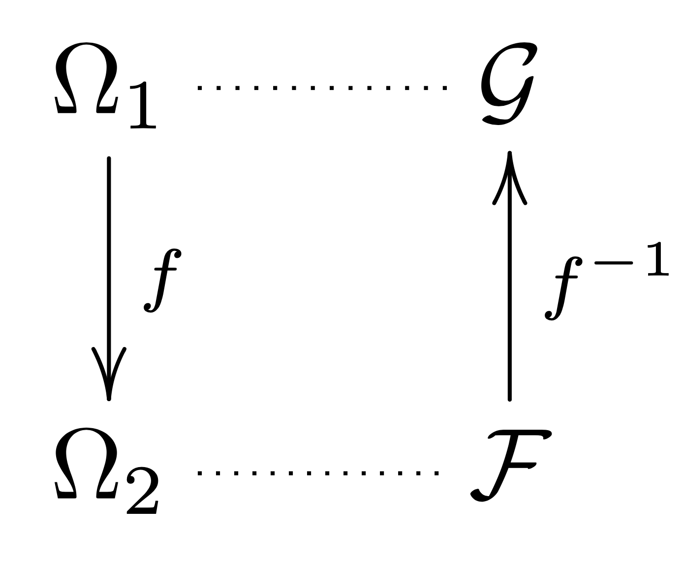

---
output:
  pdf_document: default
  html_document: default
---
# Measure Spaces

The goal in this chapter is to define the notion of a measure space
$(\Omega, \mathcal{F}, \mu)$ and work on examples to get familiar with
the relevant concepts.

Later on, we will focus our attention on two types of measures: the
Lebesgue measure $m$ and probability measures $\mathbb{P}$.

## Classes of sets {#sub:algebras}

This may be the least pleasant topic, but we *need* to go through it.

### $\sigma$-algebras

We start with the notion of $\sigma$-algebra on a sample space $\Omega$.

:::{.definition}
**($\sigma$-algebra)**. Let $\Omega$ be a sample space. A collection $\mathcal{F}$ of subsets of
$\Omega$ is called a *$\sigma$-algebra* (or $\sigma$-field) on $\Omega$, if

1.  $\Omega \in \mathcal{F}$,

2.  $A \in \mathcal{F} \implies A^c \in \mathcal{F}$,

3.  $A_1, A_2,\dots \in \mathcal{F} \implies \bigcup_{i=1}^{\infty}A_i \in \mathcal{F}$.

The pair $(\Omega, \mathcal{F})$ is called a *measurable space*. The
sets $A \in \mathcal{F}$ are called *$\mathcal{F}$-measurable sets*, or
*measurable sets* when $\mathcal{F}$ is clear from the context.
:::

In this case, it also satisfies

4.  $\emptyset \in \mathcal{F}$,

5.  $A_1, A_2,\dots \in \mathcal{F} \implies \bigcap_{i=1}^{\infty}A_i \in \mathcal{F}$.

Let us review the following examples to build our intuition.

:::{.example}
For a given sample space $\Omega$, let
$\mathcal{P}(\Omega) := \{A: A \subseteq \Omega\}$ be the power set of
$\Omega$. Then $\mathcal{P}(\Omega)$ is a $\sigma$-algebra on $\Omega$.
:::

:::{.example}
For a given sample space $\Omega$, let
$\mathcal{A} = \{\emptyset, \Omega\}$. Then $\mathcal{A}$ defines a
$\sigma$-algebra on $\Omega$, and it is called the *trivial
$\sigma$-algebra*.
:::

:::{.exercise}
Let $\Omega$ be a set and $\mathcal{A}$ the class of all subsets which
are either countable or whose complement is countable. Prove that
$\mathcal{A}$ is a $\sigma$-algebra.
:::

:::{.exercise}
Let $\mathcal{A}_1$ and $\mathcal{A}_2$ be $\sigma$-algebras on a given
sample space $\Omega$, and let
$\mathcal{A}= \mathcal{A}_1 \cap \mathcal{A}_2$ be the class made of the
sets that belong to both $\mathcal{A}_1$ and $\mathcal{A}_2$. Prove that
$\mathcal{A}:= \mathcal{A}_1 \cap \mathcal{A}_2$ is also a
$\sigma$-algebra on $\Omega$.
:::

:::{.exercise #pullback name="Pull-back"}
If $f : \Omega_1 \to \Omega_2$ and $\mathcal{F}_2$ is a $\sigma$-algebra on
$\Omega_2$, prove that
$f^{-1}(\mathcal{F}_2) := \{ f^{-1}(A): A \in \mathcal{F}_2 \}$ is a
$\sigma$-algebra on $\Omega_1$.
:::

So when a function goes from a sample space $\Omega_1$ to another space
$\Omega_2$, it pulls back any $\sigma$-algebra $\mathcal{F}$ on
$\Omega_2$ to a $\sigma$-algebra $\mathcal{G}$ on $\Omega_1$, as in the
following diagram:

```{r, include=knitr::is_latex_output(), echo=FALSE}
knitr::raw_latex("
\\begin{equation*}
\\vcenter{\\xymatrix{
  \\Omega_1  \\ar[d]^{f}  \\ar@{.}[r]
               &  \\cG
\\\\
  \\Omega_2  \\ar@{.}[r]
               & \\cF  \\ar@{->}[u]_{f^{-1}}
}}
\\end{equation*}")
```


```{r, fig.alt="TO DO", fig.align='center', echo=FALSE, out.width="25%", include=knitr::is_html_output()}

```

### The $\sigma$-algebra generated by a class

It will often be very useful to consider the $\sigma$-algebra "spanned"
by a class.

:::{.definition}
**($\sigma$-algebra generated by a class of subsets)**. Let
$\mathcal{E}$ be a class of subsets of $\Omega$. We define *the
$\sigma$-algebra generated by $\mathcal{E}$*, denoted
$\sigma(\mathcal{E})$, as the *unique* class of subsets of $\Omega$ with
the following properties:

1.  $\sigma(\mathcal{E})$ is a $\sigma$-algebra,

2.  $\sigma(\mathcal{E})\supseteq \mathcal{E}$,

3.  if $\mathcal{F}\supseteq \mathcal{E}$ and $\mathcal{F}$ is a
    $\sigma$-algebra, then $\mathcal{F}\supseteq \sigma(\mathcal{E})$.

So $\sigma(\mathcal{E})$ is the smallest $\sigma$-algebra that contains
$\mathcal{E}$.
:::

We now prove that $\sigma(\mathcal{E})$ is indeed well-defined.

::: {.proof}
*(by exercise..)* Let $\{\mathcal{A}_\alpha\}_{\alpha \in \Lambda}$
be a family of $\sigma$-algebras on $\Omega$, where $\Lambda$ is an
arbitrary *non-empty* index set. Prove that
$\bigcap_{\alpha \in \Lambda}\mathcal{A}_\alpha$ is also a
$\sigma$-algebra. Let $\mathcal{E}$ be a class of subsets of $\Omega$.
Prove that there exists *at least one* $\sigma$-algebra on $\Omega$ that
contains $\mathcal{E}$ as a subclass. Prove that $\sigma(\mathcal{E})$
exists by considering the family of $\sigma$-algebras that contain
$\mathcal{E}$. Finally, prove that $\sigma(\mathcal{E})$ is unique.
:::

One might describe $\sigma(\mathcal{E})$ as the collection of sets that
can be obtained by countably many operations of taking union,
intersection and complement of sets in $\mathcal{E}$. This description
may indeed give some comfort to those facing such bitter abstraction for
the first time, but we should not rely on it because it is hard to make
it precise. It is better to work directly with the definition.

The examples below illustrate this.

:::{.example}
Let $\Omega$ be a sample space, $A \subseteq \Omega$ and
$\mathcal{E} = \{A\}$. We claim that the $\sigma$-algebra generated by
$\mathcal{E}$ is $\mathcal{A} := \{\emptyset, \Omega, A, A^c\}$. Indeed,
$\mathcal{A}$ is a $\sigma$-algebra, it contains $\mathcal{E}$, and any
$\sigma$-algebra that contains $\mathcal{E}$ must contain $\mathcal{A}$.
:::

:::{.example #partition}
Let $\mathcal{E}= \{A_1, \dots, A_n\}$, be a partition of a sample space
$\Omega$. Then the $\sigma$-algebra generated by $\mathcal{E}$ is
$\mathcal{A} = \{A_{i_1} \cup \dots  \cup A_{i_m}: i_1,\dots,i_m \in \{1,\dots,n\}\} \cup \{\emptyset\}$.
Indeed, $\mathcal{A}$ is a $\sigma$-algebra, it contains $\mathcal{E}$,
and any $\sigma$-algebra containing $\mathcal{E}$ must contain
$\mathcal{A}$.
:::

:::{.exercise}
Let $\Omega = \{1,2,3\}$ and $\mathcal{E} = \{\{1\},\{2\},\{3\}\}$. What
is $\sigma(\mathcal{E})$?
:::

:::{.exercise}
Let $\mathcal{E}= \{\{x\}:x\in \Omega\}$ be the class of singletons.
What is $\sigma(\mathcal{E})$?
:::

:::{.proposition #sigmatrick}
Suppose $\mathcal{E}_1$ and $\mathcal{E}_2$ are
classes of subsets of $\Omega$ and
$\mathcal{E}_1 \subseteq \sigma(\mathcal{E}_2)$. Prove that
$\sigma(\mathcal{E}_1) \subseteq \sigma(\mathcal{E}_2)$.
:::

Prove the above proposition.

### The Borel sets on $\mathbb{R}$ and $\overline{\mathbb{R}}$ {#sub:borelreal}

See [Open and closed sets] for a very brief recall of basic facts from Metric Spaces.
When working on $\mathbb{R}$ or $\overline{\mathbb{R}}$, the most
important $\sigma$-algebra is the following.

:::{.definition #borelreal}
**(Borel sets on $\mathbb{R}$)** For the space
$\Omega = \mathbb{R}$, the *Borel $\sigma$-algebra*
$\mathcal{B}(\mathbb{R})$ is the $\sigma$-algebra generated by open
sets. It is also the smallest $\sigma$-algebra that contains all the
open intervals, or all the closed intervals.

For the extended line, we define
$\mathcal{B}(\overline{\mathbb{R}}) := \{ A \subseteq \overline{\mathbb{R}}: A\cap \mathbb{R}\in \mathcal{B}(\mathbb{R})\}$,
that is, we allow adding the points $\pm\infty$ to sets in
$\mathcal{B}(\mathbb{R})$.

When it is clear that $\Omega = \mathbb{R}$ or $\overline{\mathbb{R}}$,
we may write $\mathcal{B}$ instead of $\mathcal{B}(\mathbb{R})$ or
$\mathcal{B}(\overline{\mathbb{R}})$.
:::

Below we list more classes of sets, all of which generate
$\mathcal{B}(\mathbb{R})$. Any "reasonable" set is a Borel set, and it
is actually hard to construct one which is not, such as Vitali sets from
Example \@ref(exm:vitali). Nevertheless, we should keep in mind that all
the theory works on $\sigma$-algebras, and $\mathcal{B}$ is the one we
are most interested in.

Denote by $\mathcal{E}_1,\dots,\mathcal{E}_6$ the following classes of
subsets of $\mathbb{R}$, respectively:

1.  Closed subsets of $\mathbb{R}$.

2.  Open subsets of $\mathbb{R}$.

3.  Intervals of the form $(a,b)$, $a,b \in [-\infty,+\infty]$.

4.  Finite intervals of the form $(a,b]$, $a,b \in \mathbb{R}$.

5.  Semi-infinite intervals of the form $(-\infty,b]$,
    $b \in \mathbb{R}$.

6.  Semi-infinite intervals of the form $(-\infty,b)$,
    $b \in \mathbb{R}$.

One can show that $\sigma(\mathcal{E}_1)=\dots=\sigma(\mathcal{E}_6)$ as
follows: $$\sigma(\mathcal{E}_2)
\subseteq \sigma(\mathcal{E}_1)
\subseteq \sigma(\mathcal{E}_2)
\subseteq \sigma(\mathcal{E}_3)
\subseteq \sigma(\mathcal{E}_4)
\subseteq \sigma(\mathcal{E}_5)
\subseteq \sigma(\mathcal{E}_6)
\subseteq \sigma(\mathcal{E}_2)
.$$ We prove two inclusions and leave five as exercise.

Let $A \in \mathcal{E}_2$. Then $A$ is the countable union of disjoint
open intervals. So there exist
$\{I_n\}_{n\in\mathbb{N}} \subseteq \mathcal{E}_3 \subseteq \sigma(\mathcal{E}_3)$
such that $A = \cup_n I_n$. Since $\sigma(\mathcal{E}_3)$ is a
$\sigma$-algebra, it is closed under countable unions, and
$A \in \sigma(\mathcal{E}_3)$. Thus,
$\mathcal{E}_2 \subseteq \sigma(\mathcal{E}_3)$. By
Proposition \@ref(prp:sigmatrick),
$\sigma(\mathcal{E}_2) \subseteq \sigma(\mathcal{E}_3)$.

Let $A \in \mathcal{E}_5$. Then $A = (-\infty,b]$ for some
$b \in \mathbb{R}$. Consider the sequence of sets
$A_n = (-\infty,b+\frac{1}{n})$ in $\mathcal{E}_6$. Since
$\sigma(\mathcal{E}_6) \supseteq \mathcal{E}_6$ is a $\sigma$-algebra,
it is closed under countable intersections, and
$A = \cap_n A_n \in \sigma(\mathcal{E}_6)$. Thus,
$\mathcal{E}_5 \subseteq \sigma(\mathcal{E}_6)$. By
Proposition \@ref(prp:sigmatrick),
$\sigma(\mathcal{E}_5) \subseteq \sigma(\mathcal{E}_6)$.

:::{.exercise}
Prove the missing inclusions in the above chain.
:::

:::{.exercise #generateextborel}
Show that each of the classes below
generate $\mathcal{B}(\overline{\mathbb{R}})$:

1.  $\{[-\infty,a)\}_{a \in \mathbb{R}}$,

2.  $\{[-\infty,a]\}_{a \in \mathbb{R}}$,

3.  $\{[a,+\infty]\}_{a \in \mathbb{R}}$,

4.  $\{(a,+\infty]\}_{a \in \mathbb{R}}$.

Hint: first show that, if a $\sigma$-algebra contains
$\{-\infty, +\infty \}$ and $\mathcal{B}(R)$, then it contains
$\mathcal{B}(\overline{\mathbb{R}})$, then use the previous exercise.
:::

### Algebras

On a few occasions, we will use a class with less structure than
$\sigma$-algebras.

:::{.definition name="Algebra"}
Let $\Omega$ be a sample space. A class
$\mathcal{A}$ of subsets of $\Omega$ is called an *algebra on $\Omega$*,
if

1.  $\Omega \in \mathcal{A}$,

2.  $A \in \mathcal{A} \implies A^c \in \mathcal{A}$,

3.  $A, B \in \mathcal{A} \implies A \cup B \in \mathcal{A}$.
:::

In this case, it also satisfies:

1.  $\emptyset \in \mathcal{A}$,

2.  $A, B \in \mathcal{A} \implies A \cap B \in \mathcal{A}$.

In other words, an algebra on $\Omega$ is a class of subsets of
$\Omega$, which contains $\Omega$ and is *stable under finitely many set
operations*.

:::{.example}
Every $\sigma$-algebra is an algebra.
:::

:::{.remark}
If $\Omega$ is a sample space and
$\mathcal{F}_1 \subseteq \mathcal{F}_2 \subseteq \mathcal{F}_3 \subseteq \cdots$
are $\sigma$-algebras, then $\mathcal{A}:= \cup_n \mathcal{F}_n$ may not
be a $\sigma$-algebra, but it is still an algebra.
:::

:::{.exercise}
Prove that $\mathcal{A}$ in the previous remark is indeed an algebra.
:::

:::{.example #leftopenalgebra}
Let $\Omega = \mathbb{R}$ and
$$\mathcal{E} = \{(a,b]: -\infty < a < b < +\infty\}
\cup \{(a,+\infty):a\in\mathbb{R}\}
\cup \{(-\infty,b]:b\in\mathbb{R}\}
.$$ Consider the class
$$\mathcal{A} = \{I_1 \cup \dots \cup I_n: I_k \in \mathcal{E} \text{ for } k=1,\dots,n, I_k \cap I_j = \emptyset \text{ for }j\ne k\} \cup \{\mathbb{R},\emptyset\}.$$
Then $\mathcal{A}$ is an algebra. 
:::

:::{.exercise}
Prove that $\mathcal{A}$ in the
previous example is an algebra. Suggestion: show that
$\mathcal{E}\cup \{\emptyset\}$ is closed under intersections, use this
to show that $\mathcal{A}$ is closed under intersections, also show that
$\mathcal{A}$ is closed under complement, and conclude that
$\mathcal{A}$ is closed under unions.
:::

## Measures {#sub:measures}

:::{.definition}
**(Measure and $\sigma$-finite measure)** Let
$(\Omega,\mathcal{F})$ be a given measurable space. A function
$\mu : \mathcal{F}\to [0,+\infty]$ is called a *measure* if
$\mu(\emptyset)=0$ and
$$\mu \bigg( \bigcup_{n=1}^\infty A_n \bigg) = \sum_{n=1}^\infty \mu(A_n)$$
for every sequence $\{A_n\}_{n=1}^\infty \subseteq \mathcal{F}$ of
disjoint sets.

In this case, the triple $(\Omega,\mathcal{F},\mu)$ is called a *measure
space*.

We say that $\mu$ is *finite* if $\mu(\Omega)<\infty$ and
*$\sigma$-finite* if there exist measurable sets
$(A_n)_{n\in\mathbb{N}}$ such that $\mu(A_n)<\infty$ for all $n$ and
$\cup_{n\in\mathbb{N}} A_n = \Omega$.
:::

Let us start with some simple but important examples.

:::{.example #dirac name="Dirac mass measure"}
Let $\Omega$ be a set, $\mathcal{F}= \mathcal{P}(\Omega)$ and $x \in \Omega$. 
The measure $\delta_x$ is defined as $$\delta_x(A) = \dsone_A(x) $$ for all
$A \subseteq \Omega$.
:::

:::{.remark}
Even though an indicator function and a Dirac mass function perform a
similar test, they are different objects. The indicator function of a
given $A \subseteq \Omega$ is a function
$$\dsone_A:\Omega\to\{0,1\},$$ whereas the Dirac measure on a given
$x \in \Omega$ is a map $$\delta_x:\mathcal{P}(\Omega)\to\{0,1\}.$$ In
other words, $\dsone_A$ checks whether a point lies in $A$, whereas
$\delta_x$ checks whether a set contains $x$.
:::

:::{.example #harmonic name="Counting measure"}
Let $\Omega$ be a set, $\mathcal{F}= \mathcal{P}(\Omega)$, and
$$\mu = \sum_{x\in\Omega} \delta_x .$$ So
$\mu(A) = \sum_{x\in\Omega}\delta_x(A)$ counts how many elements $A$
has.
:::

:::{.example}
For $\Omega = \mathbb{N}$, $\mathcal{F}= \mathcal{P}(\Omega)$, the function
$\mu(A) = \sum_{k \in A} k^{-1}$.
:::

:::{.exercise}
Let $\mu_1,\mu_2,\dots$ be a sequence of measures on a measurable space
$(\Omega,\mathcal{F})$, and let $x_1,x_2,\dots\in[0,+\infty]$. Then
$$\mu = \sum_n x_n \mu_n$$ is a measure on $(\Omega,\mathcal{F})$.
:::

:::{.exercise #restriction name="Coarsening"}
If $(\Omega,\mathcal{F},\mu)$ is a measure space, and
$\mathcal{G}\subseteq \mathcal{F}$ is also a $\sigma$-algebra, then
$(\Omega,\mathcal{G},\mu)$ is also a measure space.
:::

:::{.example #restriction name="Restriction"}
If $(\Omega,\mathcal{F},\mu)$ is a measure space and $A \in \mathcal{F}$,
then the restriction of $\mu$ to $A$, denoted $\mu_{|_A}$ and given by
$$\mu_{|_A}(B) = \mu(A \cap B)$$ is also a measure.
:::

:::{.exercise}
Prove that the functions described in previous examples are indeed
measures.
:::

:::{.proposition #measureproperty name="Properties of a measrue"}
Let $(\Omega,\mathcal{F},\mu)$ be a measure space. Then, we have the
following properties:

1.  *Countable sub-additivity: If
    $\{A_i\}_{i=1}^{\infty} \subseteq \mathcal{F}$, then
    $$\mu\big(\cup_{i=1}^{\infty}A_i\big) \leqslant\sum_{i=1}^{\infty}\mu(A_i).$$*

2.  *Continuity from below: If
    $\{A_i\}_{i=1}^{\infty} \subseteq \mathcal{F}, A_k \subseteq A_{k+1}, \forall k \in \mathbb{N}$,
    then\
    $\mu(\bigcup_{i=1}^{\infty}A_i) := \mu(\lim\limits_{n \to \infty}A_n) = \lim\limits_{n \to \infty}\mu(A_n)$.*

3.  *Continuity from above: If
    $\{A_i\}_{i=1}^{\infty} \subseteq \mathcal{F}, A_k \supseteq A_{k+1}, \forall k \in \mathbb{N}$,
    and $\mu(A_j) < \infty$ for some $j \in \mathbb{N}$, then
    $\mu(\bigcap_{i=1}^{\infty}A_i) := \mu(\lim\limits_{n \to \infty}A_n) = \lim\limits_{n \to \infty}\mu(A_n)$.*
:::

::: {.proof}
For sub-additivity, set
$B_k := A_k \setminus (\bigcup_{i=1}^{k-1}A_i), \forall k \in \mathbb{N}$,
so that $\bigcup_{i=1}^{\infty}A_i = \bigcup_{i=1}^{\infty}B_i$, $B_k$
are disjoint and $B_k \subseteq A_k, \forall k \in \mathbb{N}$. It
follows that, $$\begin{aligned}
\nonumber
\mu\left(\bigcup_{i=1}^{\infty}A_i\right) = \mu\left(\bigcup_{i=1}^{\infty}B_i\right) = \sum_{i=1}^{\infty}\mu(B_i) \leqslant\sum_{i=1}^{\infty}\mu(A_i).\end{aligned}$$
For continuity from below, let $A_0 = \emptyset$ and
$B_k := A_k \setminus A_{k-1}, \forall k \in \mathbb{N}$, so that
$\bigcup_{i=1}^{\infty}A_i = \bigcup_{i=1}^{\infty}B_i$ and $B_k$ are
disjoint. It follows that, $$\begin{aligned}
\nonumber
\mu\left(\bigcup_{i=1}^{\infty}A_i\right)
&= \mu\left(\bigcup_{i=1}^{\infty}B_i\right) = \sum_{i=1}^{\infty}\mu(B_i) \\
\nonumber
&= \sum_{i=1}^{\infty}\mu(A_i \setminus A_{i-1}) \\
\nonumber
&= \lim_{n \to \infty} \Big( \sum_{i=1}^{n} \mu(A_i \setminus A_{i-1}) \Big) \\
\nonumber
&= \lim_{n \to \infty}\mu(A_n).\end{aligned}$$ For continuity from
above, let $B_k := A_j \setminus A_{j+k}, \forall k \in \mathbb{N}$, use
continuity from below, and subtract both sides from $\mu(A_j)$. This
concludes the proof.
:::

:::{.remark}
Continuity from above may be false without the assumption that
$\mu(A_j)$ is finite for some $j$. For instance, if $\mu$ is the
counting measure on $\mathbb{N}$ and $A_n = \{n,n+1,n+2,\dots\}$. Then
$A_n \downarrow \emptyset =: A$. Since $\mu(A_n)=\infty$ and $\mu(A)=0$,
we have $\mu(A_n) \not\to \mu(A)$ even though $A_n \downarrow A$.
:::

We now state the most important measure in the theory.


:::{.theorem #lebesgue name="Lebesque Measure"}
There exists a unique measure $m$ on
$(\mathbb{R}, \mathcal{B})$ such that $$m\big((a,b]\big) = b - a$$ for
all $a<b\in \mathbb{R}$. This measure $m$ is called the *Lebesgue
Measure* on $\mathbb{R}$.
:::

::: {.proof}
Uniqueness will be proved in
§\@ref(sub:pilambda) and existence in §\@ref(sub:caratheodory).
:::

:::{.example name="Countable sets"}
Any countable set has Lebesgue measure $0$. Although $\mathbb{Q}$ is
present everywhere in the sense that it intersects every tiny open
interval, its length is actually zero.
:::

:::{.example name="Restriction}
Given real numbers $a < b$, the function $\mu$ given by
$$\mu(A) = m(A \cap [a,b])$$ is a measure on $(\mathbb{R},\mathcal{B})$.
:::

::: {.definition name="Probability"}
A measure $\mu$ on a measurable space
$(\Omega, \mathcal{F})$ is called a *probability measure* if
$\mu(\Omega) = 1$. The triple $(\Omega, \mathcal{F}, \mu)$ is called a
*probability space*.

Probability measures are often denoted by $P$, $\mathbb{P}$ or
$\mathbf{P}$ instead of $\mu$.
:::

:::{.example}
Let $n\in\mathbb{N}$ and let $\Omega$ be a set with $n$ elements. Take
$\mathcal{F}= \mathcal{P}(\Omega)$ and
$\mathbb{P}= \frac{1}{n} \sum_{\omega \in \Omega} \delta_\omega$. Then
$(\Omega,\mathcal{F},\mathbb{P})$ is the model of equiprobable outcomes.
:::

:::{.example}
Let $n\in \mathbb{N}$, $\Omega = \{\omega_1,\dots,\omega_n\}$, and
$\mathcal{E} = \{A_1,\dots,A_n\}$, where
$A_i = \{\omega_i\}, i=1,\dots,n$. Set
$\mathbb{P}(A_i) = \mathbb{P}(\{\omega_i\}) := p_i \geqslant 0, i=1,\dots,n$,
such that $\sum_{i=1}^{n}p_i = 1$. We can extend the definition of
$\mathbb{P}$ to $\mathcal{P}(\Omega)$ by finite additivity. Then, we can
check that $\mathbb{P}$ defines a probability measure on
$(\Omega, \mathcal{P}(\Omega))$.
:::

:::{.exercise}
Let $\mathbb{P}_1,\mathbb{P}_2,\dots$ be a sequence of probability
measures on a measurable space $(\Omega,\mathcal{F})$, and let
$p_1,p_2,\dots\in[0,1]$ be such that $\sum_n p_n = 1$ Show that
$$\mathbb{P}= \sum_n p_n \mathbb{P}_n$$ is a probability measure on
$(\Omega,\mathcal{F})$. Give an interpretation to $\mathbb{P}$ and
$(p_n)_n$.
:::

::: {.definition}
**(Finite and $\sigma$-finite measure)** We say that a
measure $\mu$ is *finite* if $\mu(\Omega)<\infty$ and *$\sigma$-finite*
if there exist measurable sets $(A_n)_{n\in\mathbb{N}}$ such that
$\mu(A_n)<\infty$ for all $n$ and $\cup_{n\in\mathbb{N}} A_n = \Omega$.
:::

If $\mu(A)<\infty$, then the restriction of $\mu$ to $A$ is a finite
measure. The Dirac mass is a probability measure, hence a finite
measure. The counting measure on $\Omega$ is a finite measure if
$\Omega$ is a finite set, is a $\sigma$-finite measure if $\Omega$ is
countable, and is not a $\sigma$-finite measure if $\Omega$ is
uncountable.

Every finite measure is $\sigma$-finite (indeed, one can check the
definition by taking $A_n = \Omega$ for all $n$). The Lebesgue measure
is $\sigma$-finite (take $A_n = [-n,n]$ for all $n$). The simplest
example of a measure which is not $\sigma$-finite is the counting
measure on $\mathbb{R}$.

Whereas most of the theory developed in later chapters apply to measures
in general, several properties hold for finite and $\sigma$-finite
measures only. For instance, uniqueness in Carathéodory Extension
Theorem, Theorem \@ref(thm:measurepilambda), the Radon-Nikodým Theorem, uniqueness
of a product measure, Tonelli Theorem, and Fubini Theorem, all require
that measures be $\sigma$-finite. When a measure is finite, we have
continuity from above,
Proposition \@ref(prp:equallambda) holds, and bounded functions are
integrable (see Chapter \@ref(#sec:integral)).
