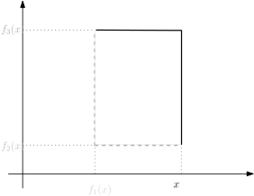
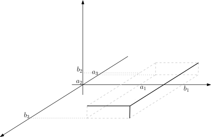

# Existence and uniqueness

In this chapter we introduce two foundational theorems in measure and
probability theories. The $\pi$-$\lambda$ Theorem allows us to establish
that certain properties hold on a large class of sets by checking them
on a much smaller class. This is useful especially when we try to show
that two measures are equal by checking that they assign the same value
to sets in a specific collection.

The Carathéodory Extension Theorem provides existence of measure spaces
starting from the specification on an algebra. We discuss how this tool
is used to construct the Lebesgue measure on $\mathbb{R}$ as well as
Lebesgue-Stieltjes measures. We conclude by discussing the Lebesgue
measure on $\mathbb{R}^d$.

## Dynkin's $\pi$-$\lambda$ Theorem and uniqueness {#sub:pilambda}

In this section we will study Dynkin's $\pi$-$\lambda$Theorem and use
it to prove the following.

::: {.theorem #measurepilambda name="Uniqueness of measures"}
Let $\mu$ and $\nu$ be measures on a measurable space $(\Omega,\mathcal{F})$, and let
$\mathcal{C}\subseteq \mathcal{F}$ be a class of subsets of $\Omega$
closed under intersection. Suppose that $\mu(A_n)=\nu(A_n)<\infty$ for
some sequence $A_n \uparrow \Omega$ of sets in $\mathcal{C}$. If
$\mu = \nu$ on $\mathcal{C}$, then $\mu = \nu$ on
$\sigma(\mathcal{C})$.
:::

Of course, the uniqueness part of 
Theorem \@ref(thm:lebesgue) is a particular case of the above theorem. For
that, we take $\mathcal{C}= \{(a,b]:a,b \in \mathbb{R}\}$, since
$\sigma(\mathcal{C})=\mathcal{B}(\mathbb{R})$ and note that
$(-n,n]\uparrow  \mathbb{R}$ are in $\mathcal{C}$ and have finite
measure.^[Note that $(a,b\rbrack = \emptyset$ when $b\leqslant a$, so 
$\emptyset\in\mathcal{C}$ and $\mathcal{C}$ is closed under intersections.]

Before introducing the concepts used in its proof, let us discuss where
they arise from. Suppose we want to check that two *finite* measures
$\mu$ and $\nu$ on the measurable space $(\Omega,\mathcal{F})$ coincide
on a large class of sets, such as $\mathcal{F}$. Suppose also that
$\mu(\Omega)=\nu(\Omega)$. On how many sets $A$ do we need to test that
$\mu(A)=\nu(A)$? Testing all $A \in \mathcal{F}$ is a bit overkilling.
Having tested for a disjoint sequence $(A_n)_n$, it will hold for
$A_1^c$ as well as $\cup_n A_n$ by elementary properties of finite
measures. However, having tested for given sets $A , B \in \mathcal{F}$,
there is no way to infer from the basic properties of measures alone
that these two measures coincide on $A \cap B$. So the idea is to
consider the class 
\begin{equation}
(\#eq:classmuequalnu)
\mathcal{D}= \{ A \in \mathcal{F}: \mu(A)=\nu(A) \}
\end{equation}
and show that it
is large. This class already has some structure inherited from the way
finite measures treat disjoint unions, but that structure is still
missing a small bit, namely being closed under intersections.


::: {.definition}
**($\pi$-system)** A class $\mathcal{C}$ of sets is called
a *$\pi$-system* if it is closed under intersections, that is,
$A \cap B \in \mathcal{C}$ for all $A,B \in \mathcal{C}$.
:::

Good examples of $\pi$-systems are the classes listed in
§ \@ref(sub:borelreal), if we add $\emptyset$ to them.

::: {.definition #lambda}
**($\lambda$-system)**. Let $\Omega$ be a sample space. A
class $\mathcal{D}$ of subsets of $\Omega$ is a *$\lambda$-system on
$\Omega$*, if $\Omega \in \mathcal{D}$ and it is closed under complement
and countable disjoint unions, that is,

1. $\ \Omega \in \mathcal{D}$,

2. $\ A \in \mathcal{D}\implies A^c \in \mathcal{D}$,
	
3. $\{A_i\}_{i=1}^{\infty} \subseteq \mathcal{D}, \ A_i \cap A_j = \emptyset \ \forall i \neq j \implies \bigcup_{i=1}^{\infty}A_i \in \mathcal{D}$.
:::

These concepts are useful when the (large and complicated) class of sets
satisfying a given property will naturally form a $\lambda$-system, and
at the same time we can find a (smaller and simpler) *subclass* that
forms a $\pi$-system and generates a large $\sigma$-algebra. This is the
case for Theorem \@ref(thm:measurepilambda).

::: {.proposition #equallambda}
If $\mu$ and $\nu$ are measures on a measurable
space $(\Omega,\mathcal{F})$ such that $\mu(\Omega)=\nu(\Omega)<\infty$,
then the class $\mathcal{D}$ defined
in \@ref(eq:classmuequalnu)is a $\lambda$-system.
:::

::: {.proof}
Suppose $A \in \mathcal{D}$. Then
$\mu(A^c) = \mu(\Omega) - \mu(A) = \nu(\Omega) - \nu(A) = \nu(A^c)$, so
$A^c \in \mathcal{D}$. Now consider a countable collection
$\{A_n\}_n \subseteq \mathcal{D}$ of disjoint sets. Then
$\mu(\cup_n A_n) = \sum_n \mu(A_n) = \sum_n \nu(A_n) = \nu(\cup_n A_n)$,
so $\cup_n A_n \in \mathcal{D}$.
:::

We now have enough motivation for the following celebrated tool.


::: {.theorem #dynkin}
**(Dynkin's $\pi$-$\lambda$ Theorem)** Let $\Omega$ be a
sample space. Suppose $\mathcal{C}$ is a $\pi$-system of subsets of
$\Omega$ and $\mathcal{D}$ is a $\lambda$-system on $\Omega$. If
$\mathcal{D}$ contains $\mathcal{C}$, then $\mathcal{D}$ contains
$\sigma(\mathcal{C})$.
:::

::: {.proof}
Given in appendix\ [Postponed proofs].
:::

::: {.proof name="Proof of Theorem \@ref(thm:measurepilambda)"}
Assume for a moment that $\mu(\Omega)=\nu(\Omega)<\infty$. Define the class $\mathcal{D}$ as
in \@ref(eq:classmuequalnu). By Proposition \@ref(prp:equallambda), $\mathcal{D}$ is a $\lambda$-system. By the $\pi$-$\lambda$ Theorem,
$\sigma(\mathcal{C}) \subseteq \mathcal{D}$, which means exactly that
$\mu=\nu$ on $\sigma(\mathcal{C})$ as claimed.

Now drop the previous assumption, and instead assume that
$\mu(A_n)=\nu(A_n)<\infty$ for some sequence $A_n \uparrow \Omega$ of
sets in $\mathcal{C}$. For each $n\in\mathbb{N}$, define the restriction
measures $\mu_n$ and $\nu_n$ by $\mu_n(A)=\mu(A \cap A_n)$ and
$\nu_n(A)=\nu(A\cap A_n)$. With this definition,
$\mu_n(\Omega)=\mu(A_n)=\nu(A_n)=\nu_n(\Omega)<\infty$. Note also that,
for each $C \in \mathcal{C}$, we have $C \cap A_n \in \mathcal{C}$
because $\mathcal{C}$ is a $\pi$-system. Hence,
$\mu_n(C) = \mu( C\cap A_n ) = \nu( C \cap A_n ) = \nu_n(C)$ for every
$C \in\mathcal{C}$.

So, for each $n$, the measures $\mu_n$ and $\nu_n$ are in the previous
case, and, for every $A \in \sigma(\mathcal{C})$, we have
$\mu_n(A)=\nu_n(A)$. Using continuity from below,
$$\mu(A) = \lim_n \mu(A\cap A_n) = \lim_n \mu_n(A) = \lim_n \nu_n(A) = \lim_n \mu(A\cap A_n)=\nu_n(A)
,$$ which concludes the proof.^[Expanded from [@Cohn13 1.6.4]]
:::

Another useful application of the $\pi$-$\lambda$ Theorem is to study
independent random variables. Suppose we know that the vector $(X,Y)$
satisfies
$$\mathbb{P}\big( (X,Y) \in (-\infty,r] \times (-\infty,t] \big)
=
\mathbb{P}\big( X \in (-\infty,r] \big)
\mathbb{P}\big( Y \in (-\infty,t] \big)$$ for all $r,t \in \mathbb{R}$.
Does it imply that $$\mathbb{P}\big( (X,Y) \in A \times B \big)
=
\mathbb{P}\big( X \in A \big)
\mathbb{P}\big( Y \in B \big)$$ for every
$A,B \in \mathcal{B}(\mathbb{R})$? The answer is yes, and the proof is a
little more ingenious than the one we just showed. It uses twice the
fact that $\{(-\infty,b]:b\in\mathbb{R}\}$ is a $\pi$-system that
generates $\mathcal{B}(\mathbb{R})$. We leave it as a teaser for now.

## Carathéodory Extension Theorem and existence {#sub:caratheodory}

In this section, we introduce the key theorem that allows us to extend a
"measure" $\mu$ from an algebra to a larger $\sigma$-algebra.

Given a sample space $\Omega$ and an algebra $\mathcal{A}$, we say that
a function $\mu : \mathcal{A}\to [0,\infty]$ is a *finitely additive
measure* if it is non-negative and finitely additive, that is,

1.  $\mu(\emptyset)=0$

2.  $\mu(A \cup B) = \mu(A) + \mu(B)$ for all disjoint
    $A,B \in \mathcal{A}$.

Note that *finitely additive* measures are not *true* measures. The
theory of finitely additive measures is rather limited, as one cannot
take limits there.

Suppose we pick a large natural number at random. The chances that this
number is odd should be $\frac{1}{2}$. The chances that a year is a leap
year should be $\frac{97}{400}$. This notion of chance is finitely
additive. For instance, the chances that a year is either odd or a leap
year would be $\frac{297}{400}$, and the chance that it is not a leap
year would be $\frac{303}{400}$. We could even talk about independent
events. For instance, this random number being a multiple of $5$ and a
multiple of $6$ would be independent, whereas a year being multiple of
$5$ and leap would not. This "frequentist" notion would be
$$\mu(A) = \lim_{n \to \infty} \frac{\#(A \cap [1,n])}{n}
,$$ and that this $\mu$ can be extended ^[This requires the Hahn-Banach Theorem 
which is a topic of Functional Analysis.] to a finitely additive
measure defined on all $\mathcal{P}(\mathbb{N})$, including sets $A$ for
which the limit does not exist. However, taking
$A_n = \{n,n+1,n+2,\dots\}$, we have $\mu(A_n) = 1$ for every $n$ in
spite of $A_n \downarrow \emptyset$ and $\mu(\emptyset) = 0$. Not really
the type of measure that we want to study here.

Fortunately, asking $\mu$ to be "$\sigma$-additive whenever possible" is
enough to fix this.

::: {.definition name="Pre-measure"} 
Given a sample space $\Omega$ and an
algebra $\mathcal{A}$, we say that a finitely additive measure
$\mu:\mathcal{A}\to [0,\infty]$ is a *pre-measure* if it is
$\sigma$-additive, that is, $\mu(\bigcup_n A_n) = \sum_n \mu(A_n)$ for
every sequence of disjoint sets $A_n \in \mathcal{A}$ whose union $A$
happens to be in $\mathcal{A}$.
:::

We now state a fundamental theorem of Measure Theory and Probability.

::: {.theorem #caratheodory name="Carathéodory Extension Theorem"}
Let $\mathcal{A}$ be an algebra on $\Omega$. If $\mu$ is a pre-measure on
$(\Omega, \mathcal{A})$, then $\mu$ extends to a measure on
$(\Omega, \sigma(\mathcal{A}))$. Moreover, if the extension $\mu$ is
$\sigma$-finite, then it is unique.
:::

We now outline the proof, and then consider its main applications.

### Outer measures and measurable sets

Here we outline the proof of
Theorem \@ref(thm:caratheodory). Given a pre-measure $\mu$ on
$(\Omega,\mathcal{A})$, we define the *outer measure*
$\mu^{*}: \mathcal{P}(\Omega) \to [0, \infty]$ as follows. For each
subset $E$ of $\Omega$, consider the collection $\mathcal{D}_E$ of all
sequences $(A_n)_n$ of sets in $\mathcal{A}$ that cover $E$:
$$\mathcal{D}_E = \Big\{ (A_n)_n : A_n \in \mathcal{A}\text{ for all } n \text{ and } E \subseteq {\bigcup}_n A_n \Big\}
.$$ The outer measure $\mu^*$ is defined by
\begin{equation}
(\#eq:externalmu)
\mu^{*}(E) =
\inf_{(A_n)\in\mathcal{D}_E} \sum_n \mu(A_n).
%\inf\left\{\sum_{i=1}^{\infty}\mu(A_i): A_j \in \mathcal{A}, \bigcup_{i=1}^{\infty}A_i \supseteq E\right\}
\end{equation}
One might think of the outer measure as a conservative upper bound for
what should be the measure of a set seen from the outside.

::: {.lemma #outer name="Properties of the outer measure"}
The outer measure $\mu^{*}$ satisfies:

$1.$  For every $E \subseteq F \subseteq \Omega$,
    $\mu^{*}(E) \leqslant\mu^{*}(F)$,
    
$2.$  For $(E_n)_{n\in\mathbb{N}}$ subsets of $\Omega$, then
    $\mu^{*}(\cup_{n} E_n ) \leqslant\sum_{n}\mu^{*}(E_n)$,
    
$3.$  For $A \in \mathcal{A}$, $\mu^{*}(A) = \mu(A)$.
:::

::: {.proof}
Given in appendix\ [Postponed proofs].
:::

Loosely speaking, problematic sets such as those of
Examples \@ref(exm:vitali) and \@ref(exm:banachtarski) are those which look bigger from the
outside than form the inside. It turns out, the way to exclude sets like
this is to consider sets $A \subseteq \Omega$ such that,
\begin{equation}
(\#eq:measurable)
\nonumber
\text{for every} \ E \subseteq \Omega,
\mu^{*}(E) = \mu^{*}(E \cap A) + \mu^{*}(E \cap A^c)
\end{equation}
The sets $A$ satisfying this condition are called
*$\mu^*$-measurable*, and $\mathcal{F}^*$ denotes the collection of such
sets.

The second property in the above lemma implies that
$$\mu^{*}(E) \leqslant\mu^{*}(E \cap A) + \mu^{*}(E \cap A^c) ,$$ so
problematic sets are those $A$ for which inequality is strict. For a
Vitali set $B$ as described in
Example \@ref(exm:vitali), we have $\mu^*(B) + \mu^*([0,1) \cap B^c) > 1$,
which one might interpret as $B$ being larger seen from the outside than
from the inside.

::: {.lemma #caratheodory name="Carathéodory"}
*The class $\mathcal{F}^*$ of $\mu^{*}$-measurable sets is a $\sigma$-algebra on $\Omega$ which
contains $\mathcal{A}$, and the restriction of $\mu^{*}$ to
$\mathcal{F}$ is a measure.*
:::

::: {.proof}
Given in appendix\ [Postponed proofs].
:::

From the two lemmas above, we have that
$\mathcal{A}\subseteq \mathcal{F}^*$, hence
$\sigma(\mathcal{A}) \subseteq \mathcal{F}^*$. Moreover, $\mu^*$,
restricted to $\sigma(\mathcal{A})$, is $\sigma$-additive, hence it is a
measure. Furthermore, $\mu^*$, restricted to $\mathcal{A}$, coincides
with $\mu$. This proves the existence part of
Theorem \@ref(thm:caratheodory).

For uniqueness, suppose $\mu^*$ is $\sigma$-finite, so there exist a
countable collection $\{A_n\}_n$ in $\sigma(\mathcal{A})$ such that
$\mu^*(A_n)<\infty$ for all $n$, and $\cup_n A_n = \Omega$.
By \@ref(eq:externalmu), for each $n$ there is a countable collection
$\{A_{n,k}\}_k$ such that $\cup_k A_{n,k} \supseteq A_n$ and
$\mu^*(A_{n,k}) < \infty$. Re-indexing the doubly-indexed countable
collection $\{A_{n,k}\}_{n,k}$ as $\{B_j\}_{j \in \mathbb{N}}$ and
defining $C_\ell = B_1 \cup \dots \cup B_\ell$, we have
$C_\ell \in \mathcal{A}$, $\mu(C_\ell)<\infty$ and
$C_\ell \uparrow \Omega$. Noting that $\mathcal{A}$ is a $\pi$-system,
it follows from the $\pi$-$\lambda$ Theorem that $\mu^*$ is the unique
measure on $\sigma(\mathcal{A})$ that agrees with $\mu$ on
$\mathcal{A}$, concluding the proof of
Theorem \@ref(thm:caratheodory).

### Lebesgue measure on $\mathbb{R}$ {#subsub:prooflebesgue}

Here we prove the existence part in
Theorem \@ref(thm:lebesgue). Fix $\Omega = \mathbb{R}$ and
$$\mathcal{E} = \{(a,b] \cap \mathbb{R}: -\infty \leqslant a < b \leqslant+\infty\}$$
as in
Example \@ref(exm:leftopenalgebra) We already know that the class
$\mathcal{A}$ of sets $A$ given by $\mathbb{R}$, $\emptyset$ and finite
unions of disjoint left open intervals is an algebra. Set
$m(I) = +\infty$ for infinite intervals $I$, and $$m((a,b]) := b-a$$ for
finite intervals $(a,b]$. We can extend the definition of $m$ to
$\mathcal{A}$ by 
\begin{equation}
(\#eq:lebesguealgebra)
m(A) = \sum_{j=1}^{n}m(I_j),
\end{equation}
where $A = I_1 \cup \dots  \cup I_n$ and
$I_k \in \mathcal{E}$ are disjoint. Note that the above formula is
well-defined even if $A$ can be written in many different ways as such a
finite disjoint union (for instance, if $I_1 = (0,1]$, $I_2 = (1,2]$, it
gives $m((0,2]) = m((0,1]) + m((1,2]) = 2$). We omit the straightforward
proof of this fact.

::: {.lemma}
The set function $m: \mathcal{A}\to [0,\infty]$ is
finitely additive.
:::

::: {.proof}
Immediate from the fact that \@ref(eq:lebesguealgebra) is well-defined.
:::

What is not so easy to prove is that $m$ is $\sigma$-additive. For
instance, take $A_k = (\frac{1}{k+1},\frac{1}{k}] \in \mathcal{E}$. Note
that the $A_k$'s are disjoint and $\bigcup_k A_k = (0,1]$, which happens
to be in $\mathcal{A}$. In this case, $$\nonumber
\sum_{j=1}^{\infty}m(A_j)
=
\sum_{j=1}^{\infty}\left(\frac{1}{j} - \frac{1}{j+1}\right)
=
1
=
m((0,1])
.$$

To conclude the proof of
Theorem \@ref(thm:lebesgue) from Theorem \@ref(thm:caratheodory), one needs to 
show that this property holds in general.

::: {.lemma #premeasure}
The set function $m: \mathcal{A}\to [0,\infty]$ is a pre-measure.
:::

::: {.proof}
Given on page [Postponed proofs]
:::

:::{.example}
If we take $A \subseteq [0,1)$ as a Vitali set, then
$A \not \in \mathcal{B}(\mathbb{R})$.
:::

:::{.proof}
*(sketch)* This is just expanding part of the sketch in
Example \@ref(exm:vitali) If $A$ were in $\mathcal{B}(\mathbb{R})$, we
could define $m(A) \geqslant 0$. Then by translation invariance, for
each $r_n \in \mathbb{Q}\cap [0,1)$, defining
$A_n = \{ x+r_n \mod 1 : x \in A \}$, we would have $m(A_n)=m(A)$.
Moreover, these sets $(A_n)_n$ are mutually disjoint and
$\cup_n A_n = [0,1)$. So
$m([0,1))=\sum_{n\in\mathbb{N}} m(A_n) = \sum_{n\in\mathbb{N}} m(A)$
which is either $0$ or $\infty$ depending on whether $m(A)>0$ or not.
This contradicts $m([0,1))=1$.
:::

### Lebesgue-Stieltjes measures {#sub:lebstiel}

Let $F: \mathbb{R} \to \mathbb{R}$ be a right-continuous non-decreasing
function. Consider the sample space $\Omega=\mathbb{R}$ and the class
$\mathcal{E} = \{ (a,b]: -\infty < a < b < +\infty \}$. Define the set
function $m_F : \mathcal{E}\to [0,\infty)$ by
$m_F((a,b]) = F(b) - F(a)$.

We can define $m_F$ on semi-infinite intervals by taking limits as
$a \to -\infty$ or $b \to +\infty$. Consider the algebra $\mathcal{A}$
defined in
Example \@ref(exm:leftopenalgebra) and revisited in
§\@ref(subsub:prooflebesgue). We can extend $m_F$ to $\mathcal{A}$
in a unique (and obvious) way so that it is finitely additive. It can be
shown that $m_F$ is, in fact, a pre-measure on $\mathcal{A}$. Again, by
Carathéodory Extension Theorem, there exists a measure $m_F$ on
$(\mathbb{R},\mathcal{B})$ that gives the right values on $\mathcal{E}$.
Moreover, since $\mathcal{E}$ is a $\pi$-system which contains a
sequence $(-n,n] \uparrow \mathbb{R}$ of sets with finite measure, this
measure is unique. Such measure is called the *Lebesgue-Stieltjes
measure* induced by the function $F$ on the space $\mathbb{R}$.

:::{.remark}
If $F(x) = x$, then $m_F$ reduces to the Lebesgue measure on
$\mathbb{R}$.
:::

:::{.remark}
We say that $F$ is a *distribution function* if it is right-continuous,
non-decreasing, $\lim_{x\to -\infty}F(x)=0$ and
$\lim_{x\to \infty}F(x)=1$. In this case, $m_F$ is a probability measure
on $\mathbb{R}$. Conversely, if $\mathbb{P}$ is a probability measure on
$\mathbb{R}$, then $F(x)=\mathbb{P}(\{\omega:\omega \leqslant b\})$ is a
distribution function. So these two types of objects are equivalent.
:::

### Lebesgue measure on $\mathbb{R}^d$

Consider the measurable space
$(\mathbb{R}^d, \mathcal{B}(\mathbb{R}^d))$, where
$\mathcal{B}(\mathbb{R}^d)$ denotes *the Borel $\sigma$-algebra on
$\mathbb{R}^d$*, $d \geqslant 1$. More precisely, we define
$\mathcal{B}(\mathbb{R}^d) := \sigma(\underline{\mathcal{E}})$, where
$$\nonumber
\underline{\mathcal{E}} = \{(\underline{a}, \underline{b}]: -\infty < a_i < b_i < +\infty, i = 1, \dots , d\}$$
and $$\nonumber
(\underline{a}, \underline{b}] = (a_1,b_1] \times \dots (a_d,b_d] \subseteq \mathbb{R}^d
.$$ Figure \@ref(fig:interval23d) illustrates the structure of elements in
$\underline{\mathcal{E}}$ for higher dimensions, which take the shape of
rectangles and cuboids for $d=2$ and $d=3$.

```{r interval23d, fig.alt="TO DO", fig.cap="Elemenets of $\\underline{\\mathcal{E}}$ for $d=2$ and $d=3$", fig.align='center', echo=FALSE, out.width="40%", fig.show="hold"}


```

It can be checked that the collection $$\nonumber
\mathcal{A}:= \{I_1 \cup \dots  \cup I_n: n \in \mathbb{N}_0, I_k \in \underline{\mathcal{E}} \text{ for } k = 1, \dots , n\}$$
is an algebra of sets on $\mathbb{R}^d$.

Now, for any
$(\underline{a},\underline{b}] \in \underline{\mathcal{E}}$, we define
the set function $$\nonumber
m\big( (\underline{a},\underline{b}] \big) := (b_1-a_1) \cdots (b_d-a_d)
%\prod_{i=1}^{d}(b_i - a_i)$$ as the $d$-dimensional volume of the
cuboid $(\underline{a},\underline{b}]$. As in
§\@ref(subsub:prooflebesgue), it is possible to prove that $m$
defines a pre-measure on $\mathcal{A}$. Hence, by Carathéodory Extension
Theorem, $m$ extends to a measure on
$(\mathbb{R}^d,\mathcal{B}(\mathbb{R}^d))$. The measure $m$ is called
the *Lebesgue measure on $\mathbb{R}^d$*, which is the analogue to the
1-dimensional case. Also, $\underline{\mathcal{E}}$ is a $\pi$-system on
$\mathbb{R}^d$ that generates $\mathcal{B}(\mathbb{R}^d)$, from which
one can also show uniqueness of $m$.


:::{.example}
Take a point set
$\{\underline{x}\} = \{(x_1,\dots ,x_d)\} \in \mathcal{B}(\mathbb{R}^d)$.
Indeed, as one might expect, the Lebesgue measure $m$ on
$(\mathbb{R}^d, \mathcal{B}(\mathbb{R}^d))$ assigns value of $0$ for
$\{\underline{x}\}$. To show this rigorously, consider
$A_k = \{\underline{y} \in \mathbb{R}^d: x_i - \frac{1}{k} \leqslant y_i \leqslant x_i, i = 1,\dots ,d\} \in \mathcal{B}(\mathbb{R}^d)$,
where $A_k \supseteq A_{k+1}, \forall k \in \mathbb{N}$. Then, one see
that $\{\underline{x}\} = \bigcap_{i=1}^{\infty}A_i$. Now, by continuity
from above, it follows that, $$\nonumber
m(\{\underline{x}\}) = m\left(\bigcap_{i=1}^{\infty}A_i\right) = \lim_{n \to \infty}m(A_n) = \lim_{n \to \infty}\left(\frac{1}{n}\right)^d = 0.$$
:::

:::{.remark}
As in the above example, monotone-convergence properties of a measure
are quite helpful when it comes to computing measures of sets.
:::

:::{.remark}
If a set in $\mathcal{B}(\mathbb{R}^d)$ is countable, then it has
Lebesgue measure $0$. Equivalently, if a set in
$\mathcal{B}(\mathbb{R}^d)$ has strictly positive Lebesgue measure, then
it is uncountable.
:::

:::{.example}
For $d \geqslant 2$, we look at a line segment
$L = \{\underline{x} \in \mathbb{R}^d: \underline{x} = r\underline{\alpha} + \underline{\beta}, \ r \in [0,1]\}$,
where $\underline{\alpha}, \underline{\beta} \in \mathbb{R}^d$ are
fixed. Set points on $L$ by,
$\underline{x}_{n,k} = \frac{k}{n}\underline{\alpha} + \underline{\beta}$,
so as to consider
$L_{n} = \bigcup_{k=1}^{n}(\underline{x}_{n,k-1}, \underline{x}_{n,k}] \in \mathcal{B}(\mathbb{R}^d)$,
where $L_{n} \supseteq L_{n+1}, \forall n \in \mathbb{N}$. The idea is
to iteratively split the line segment $L$ into smaller segments and
cover each such segment by via small squares $L_n$, which is captured in
Figure \@ref(fig:linethin)
:::

```{r linethin, fig.alt="TO DO", fig.cap="Covering $L$ by smaller boxes as $L_n$", fig.align='center', echo=FALSE, out.width="40%"}

```

Now, we can see that, $L = \bigcap_{i=1}^{\infty}L_i$, so applying
continuity from above yields, $$\nonumber
m(L) = m\left(\bigcap_{i=1}^{\infty}L_i\right) = \lim_{n \to \infty}m(L_n) = 0.$$

Notice that, $L$ lies in a subspace of $\mathbb{R}^d$. In general, if
$A \in \mathcal{B}(\mathbb{R}^d)$ lies in a subspace of $\mathbb{R}^d$,
then $m(A) = 0$.
