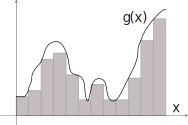
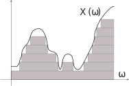
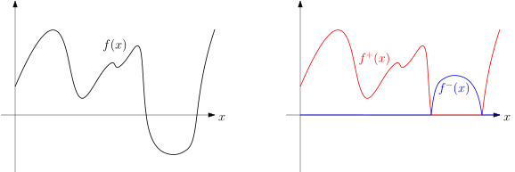
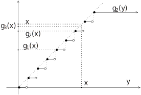
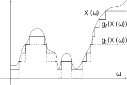

# Integration and expectation {#sec:integral}

In Real Analysis, we first introduce the Riemann Integral, which
approximates the area under a curve on a given interval via vertical
rectangles and considering a sequence of step functions that converges
to the associated curve. However this procedure is not the most suitable
to analyse sequences of functions when taking limits. In contrast, the
Lebesgue Integral considers horizontal shapes, which makes it more
flexible. It is also more descriptive as to when it is possible to take
limits. As an example, suppose we want to show that ^[Example from [@Bart95].]
$$\nonumber \lim_{n\to\infty} \int_{0}^\infty \frac{e^{-nx^2}}{\sqrt{x}} \,\mathrm{d}x
=
0$$ or $$\nonumber
\frac{\mathrm{d}}{\mathrm{d}t}
\int_{0}^{1} e^{tx} f(x) \,\mathrm{d}x
=
\int_{0}^{1} x e^{tx} f(x) \,\mathrm{d}x$$ for some bounded continuous
$f$. Sure, we could do these by brute force, making estimate over
estimate. However, these will become much easier if we use the Dominated
Convergence Theorem, to be introduced shortly.


>The reason to abandon the Riemann integral and adopt the Lebesgue
integral does not stem from the possibility of integrating exotic
functions, but rather from the robust and streamlined way in which the
Lebesgue integral commutes with limits, derivatives, Fourier series and
other integrals.

```{r riemleb, fig.alt="TO DO", fig.cap="Comparison between the Riemann integral on $\\mathbb{R}$ and the Lebesque integral on a measure space", fig.align='center', echo=FALSE, out.width="40%", fig.show="hold"}


```

Another reason to introduce the Lebesgue integral is that some measure
spaces (such as probability spaces!) are not naturally partitioned into
little intervals or little cubes, but we can still make measurements
there. In order to define an integral in this case, instead of
partitioning the domain and measuring the height of the graph of a
function, we *partition* the co-domain and *measure* chunks of the
domain, as shown in Figure \@ref(fig:riemleb).

## Axiomatic definition {#sub:intaxiom}

In this section we define the integral of extended Borel functions by
assuming existence of a linear unitary monotone $\sigma$-additive
operator on non-negative functions.

### Non-negative functions

Let $(\Omega,\mathcal{F},\mu)$ denote a measure space. The integral of
non-negative extended Borel functions against a measure $\mu$ is denoted
by $$\nonumber
\int_\Omega f \,\mathrm{d}\mu
\quad
\text{ or }
\quad
\int_\Omega f(\omega) \, \mu(\mathrm{d}\omega)$$ and defined below.

The above two formulas refer to the same operation but are useful in
different contexts. The first, rather dry formula, shows a function $f$
on a sample space $\Omega$ being integrated against a measure $\mu$. It
is very useful in theory for its conciseness, but it only works for
functions that can be referenced directly by symbols such as $f$,
$\alpha f$, $f+g$, $h \circ f$, etc. The second, more versatile, shows a
sample space, a measure with a dummy variable as indicated in
$\mu(\mathrm{d}\omega)$, and an expression which can be used to define a
function by having $\omega$ as a free variable. When the expression is
$f(\omega)$, this coincides with the first formula, but it also works
with expressions such as $\frac{\sin \omega}{e^\omega+1}$ as shown at
the beginning of this chapter. When the measure is the Lebesgue measure,
we write $\int f \,\mathrm{d}x$ or $\int f(x) \,\mathrm{d}x$.


>The Lebesgue integral is the *unique* operator with following
properties:
>  
>  -  Linear:
      $\int_\Omega (\alpha f + g) \,\mathrm{d}\mu= \alpha \int_\Omega f \,\mathrm{d}\mu+ \int_\Omega g \,\mathrm{d}\mu$;
>  
>  -   Unitary: $\int_\Omega \dsone_A \,\mathrm{d}\mu= \mu(A)$;
>  
>  -   Monotone:
      $f \geqslant g \implies \int_\Omega f \,\mathrm{d}\mu\geqslant\int_\Omega g \,\mathrm{d}\mu$;
>  
>  -   $\sigma$-additive:
      $\int_\Omega (\sum_n f_n) \,\mathrm{d}\mu= \sum_n \int_\Omega f_n \,\mathrm{d}\mu$;

>for $\alpha \in [0,+\infty]$, $A \in \mathcal{F}$ and non-negative
extended Borel functions $f,g,f_n$.


We prove existence and uniqueness of this operator in
§\ \@ref(sub:integral) Before that, let us discuss properties that follow from the above four.

:::{.exercise #zeroae}
Let $(\Omega,\mathcal{F},\mu)$ be a measure space and $f \geqslant 0$ an
extended Borel function. Show that $\int_\Omega f \,\mathrm{d}\mu= 0$ if
and only if $\mu(\{f >0 \})=0$.
:::

::: {.solution}
Suppose $\mu(\{f >0 \})>0$. Then by continuity from below of
measures, there exists $\varepsilon>0$ and $n\in\mathbb{N}$ such that
$\mu(\{ f > \frac{1}{n} \}) > \varepsilon$ (otherwise we would have
$\mu(\{f>0\}) \leqslant\varepsilon$ for every $\varepsilon$). Let
$g(\omega) = \frac{1}{n}$ if $f(\omega) > \frac{1}{n}$ and $0$
otherwise. Then $0 \leqslant g \leqslant f$, hence
$\int_\Omega f \,\mathrm{d}\mu\geqslant\int_\Omega g \,\mathrm{d}\mu> \frac{\varepsilon}{n} > 0$.
Now suppose $\mu(\{f > 0 \})=0$. Define $g(\omega) = +\infty$ if
$f(\omega)>0$ and $0$ otherwise. Then $0 \leqslant f \leqslant g$, hence
$\int_\Omega f \,\mathrm{d}\mu\leqslant\int_\Omega g \,\mathrm{d}\mu= \infty \cdot 0 = 0$.
:::

### Extended Borel functions and random variables

We now allow $f$ to take values on $[-\infty,+\infty]$, similarly
to \@ref(eq:infsum). Denote the positive and negative parts of
numbers by decomposing $$\nonumber
x = [x]^+ - [x]^-,
\quad
[x]^+ = \begin{cases}
x , & x \geqslant 0, \\
0 , & x \leqslant 0,
\end{cases}
\quad
[x]^- = \begin{cases}
0 , & x \geqslant 0, \\
-x , & x \leqslant 0.
\end{cases}$$ For a function $f$, denote its positive part $f^+$ and
negative part $f^-$ by $$\nonumber
f^\pm(\omega) = [f(\omega)]^\pm
,$$ see Figure\ \@ref(fig:fpfm) for an illustration of this decomposition. We then define
\begin{equation}
(\#eq:genintdef)
\int_\Omega f \,\mathrm{d}\mu
=
\int_\Omega f^+ \,\mathrm{d}\mu
-
\int_\Omega f^- \,\mathrm{d}\mu
\end{equation} 
unless it gives " $+\infty - \infty$ ", in which case
$\int_\Omega f \,\mathrm{d}\mu$ is *undefined*. When both integrals are
finite, we say that *$f$ is integrable*.

```{r fpfm, fig.alt="TO DO", fig.cap="Separation of extended Borel function $f:\\mathbb{R}\\to\\mathbb{R}$ by $f^+$ and $f^-$ (coloured)", fig.align='center', echo=FALSE, out.width="70%", fig.pos="H"}

```

:::{.exercise}
Let $f$ be an extended Borel function on $(\Omega,\mathcal{F},\mu)$.
Prove that $f$ is integrable if and only if
$\int_\Omega|f| \,\mathrm{d}\mu< \infty$.
:::

This definition also results in a linear and monotone operator.

::: {.theorem #intprop}
The Lebesgue integral has the following properties:

-   *Homogeneous:
    $\int_\Omega (\alpha f) \,\mathrm{d}\mu= \alpha \int_\Omega f \,\mathrm{d}\mu$*

-   *Additive:
    $\int_\Omega (f + g) \,\mathrm{d}\mu= (\int_\Omega f \,\mathrm{d}\mu) + (\int_\Omega g \,\mathrm{d}\mu)$*

-   *Monotone:
    $f \geqslant g \implies \int_\Omega f \,\mathrm{d}\mu\geqslant\int_\Omega g \,\mathrm{d}\mu$.*

*for measurable $f, g$ and $\alpha \in[-\infty,+\infty]$ as long as the
integrals are defined.*
:::

These properties apply as follows. Homogeneity holds if both integrals
are defined. Linearity is true if both integrals are defined and their
sum does not result in "$+\infty -\infty$." Monotonicity means that, if
$\int f^+ \,\mathrm{d}\mu< \infty$ or
$\int g^- \,\mathrm{d}\mu< \infty$, then both integrals are defined and
satisfy the inequality.


We prove these properties
from \@ref(eq:genintdef) in §\ \@ref(sub:integral).

:::{.exercise}
Let $f$ be a non-negative extended Borel function on
$(\Omega,\mathcal{F},\mu)$. Show that $\int_\Omega f \,\mathrm{d}\mu$ is
defined and non-negative.
:::

:::{.exercise #intnorm}
Let $f$ be an extended Borel function on $(\Omega,\mathcal{F},\mu)$. Suppose that
$\int_\Omega f \,\mathrm{d}\mu$ is defined. Show that
$|\int_\Omega f \,\mathrm{d}\mu| \leqslant\int_\Omega|f| \,\mathrm{d}\mu$.
:::

:::{.exercise}
Let $f,g$ be extended Borel functions on $(\Omega,\mathcal{F},\mu)$.
Suppose that $|f| \leqslant g$ and $g$ is integrable. Show that $f$ is
integrable.
:::

:::{.exercise}
Let $f$ be an extended Borel function on $(\Omega,\mathcal{F},\mu)$ and
$A \in \mathcal{F}$ be a measurable set. Suppose that
$\int_\Omega f \,\mathrm{d}\mu$ is defined. Show that
$\int_\Omega f\dsone_A \,\mathrm{d}\mu$ is defined.
:::

:::{.exercise}
Let $f$ be an extended Borel function on $(\Omega,\mathcal{F},\mu)$ and
$A \in \mathcal{F}$ be a measurable set. Suppose that $f$ is integrable.
Show that $f\dsone_A$ is integrable.
:::

:::{.exercise}
Show that the family of integrable functions on a given measure space
$(\Omega,\mathcal{F},\mu)$ is a vector space over $\mathbb{R}$.
:::

We now give a precise and unified definition of expectation.

::: {.definition name="Expectation"}
Let $(\Omega,\mathcal{F},\mathbb{P})$ be a probability space. For an extended random variable $X$, the
*expectation of X* is defined as 
\begin{equation}
(\#eq:defexp)
\mathbb{E}X = \int_\Omega X \,\mathrm{d}\mathbb{P}.
\end{equation}
:::

:::{.exercise}
Let $X$ be an extended random variable such that
$a \leqslant X \leqslant b$ for all $\omega \in \Omega$. Prove that
$a \leqslant\mathbb{E}X \leqslant b$.
:::

:::{.exercise}
Supposed that $X$ is an integrable extended random variable. Prove that
$\mathbb{E}[X-\mathbb{E}X] = 0$.
:::

:::{.remark}
Notation $\mathbb{E}X$ is used when the measure $\mathbb{P}$ is
arbitrary or clear form the context. If more than one measure are being
considered, one may use $\mathbf{E}$ and $\tilde{\mathbb{E}}$ for the
integrals against $\mathbf{P}$ and $\tilde{\mathbb{P}}$, etc. If we need
even more measures than fonts and tildes allow, it may be better to
write $\int_\Omega X \,\mathrm{d}\mathbb{P}_\alpha$ instead.
:::

## Main properties of the integral {#sub:intprop}

In this section we present some general properties of the integral, some
inequalities, conditions for an extended Borel function to be
integrable, and the relation with the Riemann integral.

### General properties

Given a measurable set $B \in \mathcal{F}$, the integral of $f$ on $B$
is given by the integral of the function $f \dsone_B$ which
coincides with $f$ on $B$ and is zero outside $B$:
\begin{equation}
(\#eq:integralonb)
\int_B f \,\mathrm{d}\mu:= \int_\Omega (f \dsone_B) \,\mathrm{d}\mu= \int_\Omega f \,\mathrm{d}(\mu_{|_B})
\end{equation}
The first equality above is the definition of the integral on a subset
whenever the second integral is defined. The second equality says that
the integral of $f$ on $B$ coincides with the integral of $f$ against
the measure $\mu$ restricted to $B$, as defined in
Example\ \@ref(exm:restriction), and is valid whenever one of the two is
defined.

:::{.proof}
*(Preview)* We assume that $f$ only takes values on $\{0,1\}$
(in §\ \@ref(sub:integral) we will see a standard procedure to bootstrap arguments for this type of
function to general functions). So $f = \dsone_A$ for some
$A \in \mathcal{F}$, and $$\nonumber
\int_\Omega (f \dsone_B) \,\mathrm{d}\mu
=
\int_\Omega\dsone_{A \cap B} \,\mathrm{d}\mu
=
\mu(A\cap B)
=
\mu_{|_B}(A)
=
\int_\Omega f \,\mathrm{d}(\mu_{|_B})$$
:::

All this sounds great but at some point we will want to actually
*compute* an integral. There are many methods, but the most important
one is the Fundamental Theorem of Calculus.

::: {.theorem name="Fundamental Theorem of Calculus"}
If $F$ is continuous on $[a,b]$ and $F'=f$ on $(a,b)$, then $$\nonumber
\int_{[a,b]} f \,\mathrm{d}x = F(b)-F(a),$$ where $\,\mathrm{d}x$
denotes the Lebesgue measure.*
:::

::: {.proof}
It is is the same as the proof for the Riemann integral. The
latter uses the fact that the integral is monotone, finitely additive,
and that $\int_{[a,b]} 1 \mathrm{d}x = b-a$ for all $a < b$. All these
three properties are satisfied by the Lebesgue integral against the
Lebesgue measure, hence the Fundamental Theorem of Calculus also holds
in this context.
:::

:::{.example}
$\int_0^\pi \sin x \,\mathrm{d}x = - \cos \pi + \cos 0 = 2 .$
:::

Now, going one step further in the diagram
of \@ref(def:mupush), if we have an extended Borel function defined on
$\Omega_2$, we can define its *pull-back* on $\Omega_1$ by composition:
$$\begin{aligned}
\nonumber
\begin{array}{ccccc}
\Omega_1 & \stackrel{f}{\to} & \Omega_2 & \stackrel{g}{\to} & \mathbb{R}
\\
\omega & \mapsto & \omega' & \mapsto & x
\end{array}
.\end{aligned}$$ Defining the function $f^*g = g \circ f$ on $\Omega_1$
and get $$\xymatrix{
 \Omega_1 \ar[d]^{f} \ar@{.}[r]
        & \sigma(f) \ar@{.}[r]
              & \mu \ar[d]^{\circ f^{-1}} \ar@{.}[r]
                  & f^*g
\\
 \Omega_2 \ar@{.}[r]
        & \mathcal{F}_2 \ar@{->}[u]_{f^{-1}} \ar@{.}[r]
              & f_* \mu \ar@{.}[r]
                  & g \ar[u]_{\circ f}
}$$ In summary, from a function that takes points $\omega \in \Omega_1$
to points $\omega' \in \Omega_2$, we can pull a $\sigma$-algebra on
$\Omega_2$ back to a $\sigma$-algebra on $\Omega_1$, then push a measure
on $\Omega_1$ forward to a measure on $\Omega_2$, and pull an observable
defined on $\Omega_2$ back to an observable defined on $\Omega_1$.

::: {.theorem #change name="Change of variable"}
For measurable functions
$f: \Omega_1 \to \Omega_2$ and $g: \Omega_2 \to \mathbb{R}$, we have
$$\nonumber
\int_{\Omega_2} g \,\mathrm{d}(f_*\mu)
=
\int_{\Omega_1} (f^*g) \,\mathrm{d}\mu
,$$ provided one of the two is defined.
:::

:::{.remark}
In practice, we do not compute an expectation
by \@ref(eq:defexp) but instead 
\begin{equation}
(\#eq:expcompute)
\mathbb{E}X = \int_\mathbb{R}x \, \mathbb{P}_X(\mathrm{d}x),
\end{equation}
which is a particular case of the above theorem with $f=X$ and $g(x)=x$.
:::

:::{.remark}
A familiar instance of this principle is when $f$ maps "$x$" to "$u$" and
it becomes $$\nonumber
\int_A g(f(x)) f'(x) \,\mathrm{d}x = \int_B g(u) \,\mathrm{d}u ,$$ where
$A = f^{-1}(B)$ and $\mathrm{d}u = f_* \mathrm{d}x = f'(x) \mathrm{d}x$
in a sense that will be made precise in §\ \@ref(sec:radnik).
:::

::: {.proof}
*(Preview)* We assume that $g$ only takes values on $\{0,1\}$
and leave the complete statement for
§[5.4](#sub:integral){reference-type="ref" reference="sub:integral"}. So
$g = \dsone_C$ for some $C \in \mathcal{F}_2$, and
$f^*g = \dsone_D$ where $D = f^{-1}(C) \in \mathcal{F}_1$.
Substituting these identities, we get $$\nonumber
\int_{\Omega_2} g \,\mathrm{d}(f_*\mu)
=
(f_*\mu)(C)
=
\mu(f^{-1}(C))
=
\mu(D)
=
\int_{\Omega_1} (f^*g) \,\mathrm{d}\mu$$.
:::

We say that a property holds $\mu$-*almost everywhere*, or for
$\mu$-*almost every $\omega$*, abbreviated by $\mu$-a.e., if there is a
set $A \in \mathcal{F}$ such that $\mu(A^c) = 0$ and such that this
property holds for all $\omega \in A$. In case $\mu$ is clear from the
context, we may simply say "a.e."omitting $\mu$. In case of a
probability measure, it is customary to say *a.s.* or *almost surely*
instead.

::: {.proposition #intaeequal name="a.e. equal functions"}
Let $(\Omega,\mathcal{F},\mu)$ be a measure space and
$f,g:\Omega\to\mathbb{R}$ extended Borel functions. If $f = g$
$\mu$-a.e., then $$\nonumber
\int_\Omega f \,\mathrm{d}\mu= \int_\Omega g \,\mathrm{d}\mu,$$ provided
one of the two is defined.
:::

::: {.proof}
Set $E := \{\omega:f(\omega)=g(\omega)\} \in \mathcal{F}$.
Define $f_1 = f \dsone_E$ and
$f_2 = f_1 + \infty \cdot \dsone_{E^c}$. Then $$\nonumber
0 \leqslant f_1^+ \leqslant f^+ \leqslant f_2^+
\text{ and }
0 \leqslant f_1^+ \leqslant g^+ \leqslant f_2^+.$$ 
Since $\int_\Omega f_2 \,\mathrm{d}\mu = \int_\Omega f_1 \, \mathrm{d}\mu + \infty \cdot \mu(E^c) = \int_\Omega f_1 \,\mathrm{d}\mu,$ by monotonicity we get $$\nonumber
\int_\Omega f^+ \,\mathrm{d}\mu
=
\int_\Omega g^+ \,\mathrm{d}\mu.$$ 
By a similar argument, $\int_\Omega f^- \,\mathrm{d}\mu = \int_\Omega g^- \,\mathrm{d}\mu .$ 
Assuming one of these two is finite, we get $\int_\Omega f \,\mathrm{d}\mu = \int_\Omega g \,\mathrm{d}\mu .$
:::

:::{.remark}
Most of measure theory is insensitive to whether two functions differ on
a set of zero measure. In upcoming sections and chapters, the reader
will see that two a.e. functions are basically the same function for
(almost!) all practical purposes.
:::

:::{.exercise #aezero}
Let $f$ be an extended
Borel function on a measure space $(\Omega,\mathcal{F},\mu)$ such that
$\mu(f\ne 0)=0$. Show that $\int_\Omega f \,\mathrm{d}\mu= 0$.
:::

### Inequalities

The following inequality is fundamental for many arguments in Measure
Theory and Probability.

::: {.theorem #chebyshev name="Chebyshev's inequality"}
Let $(\Omega,\mathcal{F},\mu)$ be a measure space and $f:\Omega\to \overline{\mathbb{R}}$ an extended
Borel function. Then, for all $\varepsilon > 0$ and $\alpha > 0$,
$$\nonumber
\mu(\{|f|\geqslant\varepsilon\}) \leqslant\frac{1}{\varepsilon^\alpha}\int_{\Omega} |f|^\alpha \,\mathrm{d}\mu
.$$
:::

::: {.proof}
*Proof.* Let $\varepsilon \geqslant 0$ and $\alpha \geqslant 0$. Then we
have that, $$\begin{gathered}
\nonumber
\int_\Omega |f|^\alpha \,\mathrm{d}\mu\geqslant\int_{\{|f| \geqslant\varepsilon\}} |f|^\alpha \,\mathrm{d}\mu\geqslant\int_{\{|f| \geqslant\varepsilon\}} \varepsilon^\alpha \,\mathrm{d}\mu=\\= \varepsilon^\alpha \int_\Omega \dsone_{\{|f| \geqslant\varepsilon\}}\,\mathrm{d}\mu= \varepsilon^\alpha \mu(\{|f|\geqslant\varepsilon\}),\end{gathered}$$
and by rearranging, the inequality follows.
:::

:::{.remark}
In the setting of $(\Omega,\mathcal{F},\mathbb{P})$ being a probability
space and $X:\Omega\to \overline{\mathbb{R}}$ an extended random
variable, $\forall \varepsilon \geqslant 0$ and $\alpha \geqslant 0$,
$$\nonumber
\mathbb{P}(|X| \geqslant\varepsilon) \leqslant\frac{1}{\varepsilon^\alpha}\mathbb{E} |X|^\alpha
,$$ which is sometimes referred to as *Markov's inequality*. We can, in
turn, bound deviation from the mean using the variance of $X$ by,
$$\label{eq:chebyshev}
\mathbb{P}(|X - \mathbb{E} X| \geqslant\varepsilon) \leqslant\frac{1}{\varepsilon^2}\mathbb{V}X.$$
This is sometimes also referred to as Chebyshev's inequality.
:::

:::{.exercise}
Let $X$ be a random variable such that, almost surely,
$a \leqslant X \leqslant b$. Suppose $X$ is not almost-surely equal to a
constant. Prove that $a < \mathbb{E}X < b$.
:::

For the next inequality, we recall the notion of a *convex function*.
For an open interval $I \subset \mathbb{R}$, a function
$f : I \to \mathbb{R}$ is called *convex* if for every $x,y \in I$ and
$a,b \in [0,1]$ with $a + b = 1$, we have $$\nonumber
f(ax + by) \leqslant af(x) + bf(y).$$ This inequality means that any
line segment joining two points in the graph of $f$ stay above the
graph. In case $f$ is twice differentiable, it is convex if and only if
$f''(x) \geqslant 0$ for every $x \in I$. Examples of convex functions
are $|x|$, $e^x$, $ax+b$, $x^2$ and $[x]^+$ on $\mathbb{R}$, as well as
$x^{-2}$, $-\log x$, $-\arctan x$ and $x^{-1}$ on $(0,+\infty)$.

::: {.theorem #jensen name="Jensen's inequality"}
Let $X$ be an integrable random
variable taking values on an open interval $I$, and
$f : I \to \mathbb{R}$ a convex function. Then, $$\nonumber
f(\mathbb{E}X) \leqslant\mathbb{E}f(X).$$
:::

::: {.proof}
Since $f$ is convex, by [@Kle14 Corollary7.8(ii)], for each
$x_0 \in I$, there is $c \in \mathbb{R}$ such that $$\nonumber
f(x) \geqslant f(x_0) + c (x - x_0), \ \forall x \in I
.$$ Choosing $x = X$ and $x_0 = \mathbb{E}X$, we get $$\nonumber
f(X) \geqslant f(\mathbb{E}X) + c \cdot (X - \mathbb{E}X), \ \text{a.s.},$$
and taking expectations on both sides we get the stated
inequality.^[Based on [@Shir16 §2.6.7].]
:::


::: {.theorem name="Cauchy-Schwarz Inequality"}
If $\mathbb{E}X^2<\infty$
and $\mathbb{E}Y^2<\infty$, then $XY$ is integrable and
$$\mathbb{E}[XY] \leqslant\sqrt{\mathbb{E}X^{2}} \, \sqrt{\mathbb{E}Y^{2}}.$$
:::


::: {.proof}
We can assume $\mathbb{E}X^2 = 1$ and $\mathbb{E}Y^2 = 1$
(why?). The inequality follows immediately from the trick
$$0 \leqslant\mathbb{E}(X-Y)^2 = 2 - 2 \mathbb{E}[XY].
\qedhere$$
:::

:::{.example}
Let $(\Omega,\mathcal{F},\mathbb{P})$ be a probability space and
$X = \dsone_A, Y = \dsone_B$ be Bernoulli random variables with
parameter $p$, where $A, B$ are events in $\mathcal{F}$. Further, assume
that $A$ and $B$ are independent, i.e.
$$\mathbb{P}(A \cap B) = \mathbb{P}(A) \mathbb{P}(B) = p^2.$$ Then, we
can see that
$$\mathbb{E}[XY] = \mathbb{E}[\dsone_A \dsone_B] = \mathbb{E}[\dsone_{A \cap B}] = \mathbb{P}(A \cap B) = \mathbb{P}(A) \mathbb{P}(B) = p^2.$$
On the other hand, we have
$$\sqrt{\mathbb{E}X^{2}} \, \sqrt{\mathbb{E}Y^{2}} = \sqrt{\mathbb{E}X} \, \sqrt{\mathbb{E}Y} = p,$$
and since $p \in (0,1)$ by construction, Cauchy-Schwarz Inequality is
verified.
:::

### Integrability

::: {.proposition}
Suppose there is a countable set
$A \subseteq [0,+\infty]$ such that $X$ only takes values in $A$. Then
$$\mathbb{E}X = \sum_{x\in A} x \mathbb{P}(X=x).$$
:::

::: {.proof}
Using $\sigma$-additivity of the expectation, $$\nonumber
\mathbb{E}X
=
\mathbb{E}\Big[ \sum_{ x\in A } x \cdot \dsone_{[X=x]} \Big]
=
\sum_x x \mathbb{E}\dsone_{[X=x]}
=
\sum_x x \mathbb{P}(X=x)
.
\qedhere$$
:::

:::{.example}
If $\mathbb{P}(X=n)= \frac{\lambda^n e^{-\lambda}}{n!}$ for
$n \in \mathbb{N}_0$, then $$\begin{gathered}
\nonumber
EX
=
\sum_{n=0}^\infty n \frac{\lambda^n e^{-\lambda}}{n!}
=
\sum_{n=1}^\infty \frac{\lambda^n e^{-\lambda}}{(n-1)!}
=
\\
=
\lambda e^{-\lambda}
\sum_{n=1}^\infty \frac{\lambda^{n-1}}{(n-1)!}
=
\lambda e^{-\lambda}
\sum_{n=0}^\infty \frac{\lambda^n}{n!}
=
\lambda e^{-\lambda} e^\lambda
=
\lambda,\end{gathered}$$ giving the familiar formula for the expectation
of a Poisson variable.
:::

::: {.proposition}
If $X$ only takes values on
$\{0,1,2,3,\dots,+\infty\}$, then
$$\mathbb{E}X = \sum_{n\in\mathbb{N}} \mathbb{P}( X \geqslant n).$$
:::

::: {.proof}
Let $A = \{0,1,2,3,\dots,+\infty\}$. Replacing $n$ by a dull
sum over $k$, $$\begin{gathered}
\nonumber
\mathbb{E}X
=
\sum_{n \in A} n \mathbb{P}(X=n)
= \sum_{n \in A} \sum_{k \in \mathbb{N}} \dsone_{k \leqslant n} \mathbb{P}(X=n)
=
\\
= \sum_{k \in \mathbb{N}} \sum_{n \in A} \dsone_{n \geqslant k} \mathbb{P}(X=n)
= \sum_{k \in \mathbb{N}} \sum_{n \geqslant k} \mathbb{P}(X=n)
= \sum_{k \in \mathbb{N}} \mathbb{P}(X \geqslant k)
,\end{gathered}$$ where
Theorem\ \@ref(thm:seriestonelli) was used to interchange sums.
:::

:::{.example}
If $\mathbb{P}(X \in \mathbb{N}_0) = 1$ and
$\mathbb{P}( X \geqslant n ) = (1-p)^{n-1}$ for all $n \in \mathbb{N}$,
where $0 < p < 1$, then $$\nonumber
\mathbb{E}X
= \sum_{n=1}^{\infty} P(X\geqslant n)
= \sum_{n=1}^{\infty} (1-p)^{n-1}
= \sum_{j=0}^{\infty} (1-p)^{j}
= \frac{1}{1-(1-p)}
= \frac{1}{p}
,$$ giving the familiar formula for the expectation of a Geometric
variable.
:::

:::{.remark}
The above propositions and their proof also work for measure spaces with
$X$ replaced by $f$ and $\mathbb{E}$ by
$\int_\Omega\cdots \,\mathrm{d}\mu$.
:::

::: {.proposition #inttest}
A random variable $X$ is integrable if and only if
$$\sum_n \mathbb{P}(|X|\geqslant n) < \infty .$$
:::

Above we do not specify whether $n=0$ or $n=\infty$ are included in the
sum, because all that matters is whether the sum is finite.

::: {.proof}
Let $Z = |X|$ and $Y = \lfloor Z \rfloor$. Observe that
$$\mathbb{E}Y = \sum_{n} \mathbb{P}(Y \geqslant n) = \sum_{n} \mathbb{P}(Z \geqslant n).$$
On the other hand, $Y \leqslant Z \leqslant Y + 1$. By additivity, we
have $\mathbb{E}[Y+1] = (\mathbb{E}Y) + 1$. By monotonicity,
$\mathbb{E}Y \leqslant\mathbb{E}Z \leqslant(\mathbb{E}Y) + 1$. If one of
these numbers is finite, all the others are finite, and if one is
infinite, all the others are infinite (why?). This concludes the
proof.
:::

:::{.exercise}
Can you find which parts of the proof break down if we work on a measure
space instead of probability space? Can you find counter-examples?
:::

### Relation to the Riemann integral

We conclude this section with a comparison with the Riemann integral.

::: {.theorem}
Let $f : [a,b]\to \mathbb{R}$ be a Borel function. If
$f$ is Riemann integrable then it is Lebesgue integrable and the value
of both integrals coincide.
:::

::: {.proof}
Using the definition from [@Cohn13 §2.5], the Riemann integral
of $f$ on $[a,b]$ equals $L \in \mathbb{R}$ if, for every
$\varepsilon > 0$, there exist step functions $g$ and $h$ such that
$g \leqslant f \leqslant h$ and
$L - \varepsilon < \int_{[a,b]} g \,\mathrm{d}x \leqslant\int_{[a,b]} h \,\mathrm{d}x < L + \varepsilon$.
But this implies that $g$ and $h$ (and hence $f$) are bounded, therefore
$\int_{[a,b]} f \,\mathrm{d}x$ is defined and
$| \int_{[a,b]} f \,\mathrm{d}x - L | < \varepsilon$. Since this holds
for every $\varepsilon>0$, we get $\int_{[a,b]} f \,\mathrm{d}x = L$.
:::

:::{.remark}
The converse is false. A function can be Lebesgue integrable and not
Riemann integrable. In case $f$ is unbounded, it is not Riemann
integrable even if it is continuous at almost every point.
:::

Another popular example is $f:[0,1]\to\mathbb{R}$ given by
$f = \dsone_\mathbb{Q}$. Since $m(\mathbb{Q})=0$, we have
$\int_{[0,1]} f \,\mathrm{d}x = 0$ but this function is not Riemann
integrable.^[Let us prove that it is not Riemann integrable. Consider any
partition of $[0,1]$ into finitely many non-degenerate intervals,
and notice that all intervals will contain both rational and
irrational numbers. Thus, every step function $g \leqslant f$ must
satisfy $g \leqslant 0$ a.e., and every step function
$h \geqslant f$ must satisfy $h \geqslant 1$ a.e. Hence,
$\int g \,\mathrm{d}x \leqslant 0$ and
$\int h \,\mathrm{d}x \geqslant 1$ and taking
$\varepsilon=\frac{1}{3}$ we see that there is no number $L$ such
that
$L - \varepsilon < \int g \,\mathrm{d}x \leqslant\int h \,\mathrm{d}x < L + \varepsilon$.]

:::{.remark}
The reader may wonder what happens if $f$ is Riemann integrable but not
Borel measurable. We will never bump into such a function unless we are
looking for it. In any case, if $f : [a,b] \to \mathbb{R}$ is Riemann
integrable then it is measurable with respect to a $\sigma$-algebra
larger than $\mathcal{B}$, denoted $\mathcal{F}^*$ in
Lemma\ \@ref(lem:caratheodory), it is Lebesgue integrable and again the
value of both integrals coincide. See [@Cohn13 2.5.4] for a proof.
:::

### The fallacy of improper integrals {#ssub:fallacy}

It is often claimed that there are functions which are Riemann
integrable but not Lebesgue integrable. The infamous example is
$$f(x) = \frac{\sin x}{x} \cdot \dsone_{[\pi,+\infty)}(x)
,$$ usually followed by the pompous claim that it is Riemann integrable.

The reason why this function causes some commotion is that $f$ is not
Lebesgue integrable (proof omitted) but nevertheless the limit
$$\lim_{z\to+\infty}
\int_{[\pi,z]} f(x) \,\mathrm{d}x$$ is finite (proof omitted). Some
would infer form this that $f$ is Riemann integrable but not Lebesgue
integrable, without realising that the above limit is the same
regardless of whether the integral on $[\pi,z]$ is Lebesgue or Riemann.

Anyway, there are some serious problems with the *interpretation* of
this limit. It is finite, so what? As far as Measure Theory and
Probability Theory are concerned, this limit has no meaning. It takes
*one particular* sequence of sets $A_n$ satisfying
$A_n \uparrow [\pi,+\infty)$. By picking another sequence with the same
property, one can make this limit give *any* number in
$\overline{\mathbb{R}}$ (proof omitted). There is no physical
interpretation of this limit in terms of signed areas, centre of mass,
etc. If this limit were to be understood as the value of the integral,
Theorem\ \@ref(thm:change) would not hold. If it were to correspond to the
expectation of a random variable, the law of large numbers would not
hold either.

## Convergence of integral and applications {#sub:intconv}

We can think of the region under the graph of a non-negative extended
real function as having an area, volume or mass. If the function is
$f(x) = n \cdot \dsone_{(0,\frac{1}{n}]}(x)$, or
$g(x)=\dsone_{(n,n+1]}(x)$, this mass is always equals to $1$ and,
nevertheless, it disappears when we let $n \to \infty$. In both cases,
we can say that the mass "escaped to infinity." In the former case it
disappeared vertically and in the latter case, horizontally. The three
properties studied in this section explain what can happen to this mass
when we take limits.

### The main theorems

The Monotone Convergence Theorem says that nothing strange can happen
with the mass of an increasing sequence. More precisely, it says that
extra mass cannot appear in the limit.

::: {.theorem name="Monotone Convergence Theorem"}
Let $(f_n)_n$ be a non-decreasing sequence of non-negative extended Borel functions on
$(\Omega,\mathcal{F},\mu)$. Then $$\nonumber
\lim_{n \to \infty} \int_\Omega f_n(\omega) \mu (\mathrm{d}\omega)
=
\int_\Omega (\lim_{n \to \infty} f_n(\omega)) \mu(\mathrm{d}\omega)
.$$
An easier way to remember is:
$0 \leqslant f_n \uparrow f \implies \int f_n \,\mathrm{d}\mu\uparrow \int f \,\mathrm{d}\mu$.
:::

::: {.proof}
We included $\sigma$-additivity as an axiom instead of monotone
convergence for aesthetic reasons, so the proof is a bit dull. Write
$f_n = g_1 + \dots + g_n$. Then $\sum_n g_n = f$, and by
$\sigma$-additivity we have $$\nonumber
\int_\Omega f \,\mathrm{d}\mu= \int_\Omega({\textstyle\sum}_n g_n) \,\mathrm{d}\mu= {\textstyle\sum}_n \int_\Omega g_n \,\mathrm{d}\mu= \lim_n \int_\Omega f_n \,\mathrm{d}\mu.$$
In §\@ref(sub:integral) we will re-prove this theorem in order to prove $\sigma$-additivity.
:::

From this theorem, we derive another fundamental property relating
integrals and limits. Fatou's lemma says that, even though the previous
examples show that even though we can lose mass in a limit, we can never
gain mass.

::: {.theorem name="Fatou's lemma"}
Let $(\Omega,\mathcal{F},\mu)$ be a
measure space and $(f_n)_{n\geqslant 1}$ a sequence of non-negative
extended Borel functions. Then, $$\nonumber
\int_\Omega (\liminf_{n\to\infty}f_n(\omega)) \,\mu(\mathrm{d}\omega) \leqslant\liminf_{n\to\infty}\int_\Omega f_n(\omega) \,\mu(\mathrm{d}\omega)
.$$
To remember the inequality, we consider functions
$f_n = \dsone_{[n,\infty)}$.
:::

::: {.proof}
Taking $$\nonumber
g_n(\omega) = \inf_{k \geqslant n} f_k(\omega)$$ and defining
$$\nonumber g(\omega) = \liminf_{n\to\infty} f_n(\omega),$$ we have that
$0 \leqslant g_n \uparrow g.$ By the Monotone Convergence Theorem, $$\nonumber
\lim_{n \to \infty} \int_\Omega g_n \,\mathrm{d}\mu= \int_\Omega g \,\mathrm{d}\mu.$$
Since $g_n \leqslant f_n,$ we get 
\begin{equation}
\nonumber
\liminf_{n\to\infty} \int_\Omega f_n \,\mathrm{d}\mu
\geqslant
\liminf_{n\to\infty} \int_\Omega g_n \,\mathrm{d}\mu
=
\int_\Omega g \,\mathrm{d}\mu
=
\int_\Omega (\liminf_{n\to\infty} f_n) \,\mathrm{d}\mu
\end{equation}
concluding the proof.
:::

The Dominated Convergence Theorem says that, if the graphs of a sequence
$f_n$ of functions are confined in a region of finite mass, then we
cannot lose mass in the limit either. The reason is that the graph of
$f_n$ divides this region of finite mass in two parts, and the fact that
each of the two parts cannot gain mass in the limit implies that the
other one cannot lose it.


::: {.theorem #dct name="Dominated Convergence Theorem"}
Let $(\Omega,\mathcal{F},\mu)$ be a measure space and $(f_n)_{n\geqslant 1}$
a sequence of extended Borel functions such that
$f_n(\omega) \to f(\omega)$ as $n \to \infty$ for a.e. $\omega$. If
there exists a non-negative extended Borel function $g$ that is
$\mu$-integrable, such that $|f_n| \leqslant g$ for all $n \geqslant 1$,
then $f$ is $\mu$-integrable, and $$\nonumber
\lim_{n \to \infty} \int_\Omega f_n(\omega) \mu (\mathrm{d}\omega)
=
\int_\Omega \Big(\lim_{n \to \infty} f_n(\omega)\Big) \mu(\mathrm{d}\omega)
.$$
:::

::: {.proof}
By changing $f_n,f,g$ on a set of measure zero, we can assume
that convergence holds for every $\omega$. Notice that
$f_n + g \geqslant 0$ for all $n\geqslant 1$, so by Fatou's lemma, we
get that $$\nonumber
\int_\Omega(f+g) \,\mathrm{d}\mu\leqslant\liminf_{n\to\infty}\int_\Omega (f_n + g) \,\mathrm{d}\mu$$
and hence $$\nonumber
\int_\Omega f \,\mathrm{d}\mu\leqslant\liminf_{n\to\infty}\int_\Omega f_n \,\mathrm{d}\mu.$$
Similarly, we have that $-f_n + g \geqslant 0$ for all $n\geqslant 1$,
which gives $$\nonumber
\int_\Omega(-f+g) \,\mathrm{d}\mu\leqslant\liminf_{n\to\infty}\int_\Omega (-f_n + g) \,\mathrm{d}\mu$$
and hence $$\nonumber
\int_\Omega f \,\mathrm{d}\mu\geqslant\limsup_{n\to\infty}\int_\Omega f_n \,\mathrm{d}\mu.$$
From these two inequalities, we get $$\nonumber
\lim_{n\to\infty}\int_\Omega f_n \,\mathrm{d}\mu= \int_\Omega f \,\mathrm{d}\mu.$$
:::

### Some corollaries and applications

::: {.corollary #antimct }
If $f_n \downarrow f \geqslant 0$ a.e.and $f_1$ is
integrable, then
$\int_\Omega f_n \,\mathrm{d}\mu\to \int_\Omega f \,\mathrm{d}\mu$.
:::

::: {.proof}
Exercise.
:::

::: {.corollary}
Let $(X_n)_n$ be extended random variables such that $\sum_n \mathbb{E}|X_n|$ converges. 
Then $\sum_n X_n$ converges a.s.,
and $\mathbb{E}[\sum_n X_n] = \sum_n \mathbb{E}X_n$.
:::

::: {.proof}
Exercise. Suggested pathway: $\sum_n |X_n(\omega)|$ is defined
for every $\omega$, $\mathbb{E}\big[ \sum_n |X_n| \big] < \infty$,
$\sum_n X_n(\omega)$ converges
a.s.,$\mathbb{E}[\sum_{j=1}^n X_j] \to \mathbb{E}[\sum_{j=1}^\infty X_j]$.
:::

::: {.corollary name="Bounded Convergence Theorem"}
If $X_n {\to} X$a.s. and there is $M\in\mathbb{R}$ such that $|X_n| \le M$ a.s. for all
$n$, then $\mathbb{E}X_n \to \mathbb{E}X$.
:::

::: {.proof}
Apply the Dominated Convergence Theorem with constant $g=M$.
:::

::: {.corollary}
Suppose $0 \leqslant f_n \uparrow f$, and there is
$M \in \mathbb{R}$ such that $\int_\Omega f_n \,\mathrm{d}\mu< M$ for
all $n$. Then $f(\omega)<\infty$ for a.e. $\omega$.
:::

::: {.proof}
Exercise.
:::

:::{.exercise}
Suppose $0 \leqslant f_n \leqslant g$, and $g$ is integrable. Show that
$$\limsup_{n\to\infty}\int_\Omega f_n(\omega) \,\mu(\mathrm{d}\omega)
\leqslant
\int_\Omega (\limsup_{n\to\infty}f_n(\omega)) \,\mu(\mathrm{d}\omega)
.
\qedhere$$
:::

::: {.proposition name="Moment generating function"}
Let $M(t)=\mathbb{E}e^{tX}$ and suppose there exists $\varepsilon > 0$ such
that $M(t)<\infty$ for $-\varepsilon < t < \varepsilon$. Then
$$M^{(k)}(0)=\mathbb{E}X^k$$ for $k=0,1,2,3,\dots$.
:::

::: {.proof}
We will show a stronger statement, namely that $$\frac{ \,\mathrm{d}^{k}}{\mathrm{d}t^{k}}M_{X}(t) = \mathbb{E}[X^{k}e^{tX}]$$
for every $t\in(-\varepsilon,+\varepsilon)$, by induction on $k$.

For $k=0$ we have the identity $M_X(t)=\mathbb{E}e^{t X}$ which holds
trivially. Suppose the identity holds for some $k \in \mathbb{N}$. Write
$g_x(t)=x^k e^{t x}$ and $g_x'(t)=x^{k+1} e^{t x}$. Then $$\nonumber
\frac{\mathrm{d}}{\mathrm{d}t} M^{(k)}_X (t)
=
\frac{\mathrm{d}}{\mathrm{d}t} \mathbb{E}g_X(t)
=
\lim_{h \to 0} \mathbb{E}\frac{g_X(t+h)-g_X(t)}{h}
.$$ If we can commute the expectation and the limit, we get $$\nonumber
M^{(k+1)}_X (t)
=
\mathbb{E}\lim_{h \to 0} \frac{g_X(t+h)-g_X(t)}{h}
=
\mathbb{E}g_X'(t) = \mathbb{E}[X^{k+1}e^{t X}]
.$$ Fix a sequence $h_n \to 0$. In order to apply the Dominated
Convergence Theorem, it is enough to bound the random term
$|\frac{g_X(t+h)-g_X(t)}{h}|$ by an integrable extended random variable.
By the Mean Value Theorem, $$\nonumber
\frac{g_x(t+h)-g_x(t)}{h} = g_x'(\theta)
,$$ where $\theta\in[t,t+h]$ depends on $x$, $t$ and $h$. Taking
$\delta = \frac{\varepsilon-|t|}{3}$, for $|h|<\delta$ we have
$$\nonumber
|g'_x(\theta)|
\le
|x|^{k+1}e^{(\varepsilon-2\delta)|x|}
\leqslant C e^{(\varepsilon-\delta)|x|}
\quad
\text{for every } x\in \mathbb{R},$$ where $C$ depends on $\varepsilon$
and $t$. It follows from the assumption that
$\mathbb{E}e^{(\varepsilon-\delta)|X|}<\infty$, which concludes the
proof.
:::

## Construction of the integral {#sub:integral}

In this last section we prove the existence and uniqueness of the
operator $f \mapsto \int_\Omega f \,\mathrm{d}\mu$ defined on
non-negative extended Borel functions $f$. In this process, we will show
that non-negative functions can be approximated by simple functions,
which allows us to bootstrap properties proved for binary functions
(such as Theorem\ \@ref(thm:change)) to general measurable functions.

### Simple functions {#subsub:intsimple}

We say that $f$ is a *simple function* if it is measurable and only
takes finitely many values. In case $f$ is also non-negative, we define
its integral as $$\nonumber
\int_\Omega f \,\mathrm{d}\mu:= \sum_x x \cdot \mu(f=x)
,$$ where "$\mu(f=x)$" means $\mu(\{\omega\in\Omega:f(\omega)=x\})$. Let
$a_1,\dots,a_n$ denote the distinct values attained by $f$, and
$A_1,\dots,A_n\in\mathcal{F}$ the sets where $f$ takes these values.
Then the sets $A_1,\dots,A_n$ form a partition of $\Omega$ and
$$\nonumber
f = \sum_{j=1}^n a_j \dsone_{A_j}
.$$ This representation is unique except for permutation of the indices
$\{1,\dots,n\}$. In this representation, we have
\begin{equation}
(\#eq:intsimpledef)
\int_\Omega f \,\mathrm{d}\mu= \sum_{j=1}^n a_j \mu(A_j)
\end{equation}
for every $f$
non-negative and simple.

::: {.lemma}
This definition is unitary, monotone, and linear.
:::

It is unitary by construction. Monotonicity follows directly from
linearity. Indeed, if $f \geqslant g \geqslant 0$ are simple, then
$h:=f-g$ is non-negative and simple, and
$\int_\Omega f \,\mathrm{d}\mu= \int_\Omega g \,\mathrm{d}\mu+ \int_\Omega h \,\mathrm{d}\mu\geqslant\int_\Omega g \,\mathrm{d}\mu$.
So it remains to prove linearity.

::: {.lemma}
If $A_1,\dots,A_n \in \mathcal{F}$ form a partition of
$\Omega$ and $f = \sum_{j=1}^n a_j \dsone_{A_j}$, then
$\int_\Omega f \,\mathrm{d}\mu= \sum_{j=1}^n a_j \mu(A_j)$, even if
$a_1,\dots,a_n \in [0,+\infty]$ are not distinct.
:::

::: {.proof}
*(Idea)* Group the sets $A$ corresponding to same value $a$.
:::

::: {.proof name="Proof of linearity"}
Write $f = \sum_{j=1}^n a_j \dsone_{A_j}$ and
$g = \sum_{i=1}^k b_i \dsone_{B_i}$, where both $A_1,\dots,A_n$ and
$B_1,\dots,B_k$ form partitions of $\Omega$. After expanding and
grouping, $$\nonumber
af + bg = \cdots =
\sum_{j=1}^n \sum_{i=1}^k (aa_j+bb_i) \dsone_{A_j \cap B_i}
.$$ But the collection $\{A_j \cap B_i\}_{j=1,\dots,n;i=1,\dots,k}$
forms a partition of $\Omega$, so using the previous lemma we get
$$\nonumber
\int_\Omega(af+bg) \,\mathrm{d}\mu=
\sum_{j=1}^n \sum_{i=1}^k (aa_j+bb_i) \mu({A_j \cap B_i})
.$$ Splitting the terms in the sum and using that $B_1,\dots,B_k$ as
well as $A_1,\dots,A_n$ are partitions, one can eventually gets
$$\nonumber
\int_\Omega(af+bg) \,\mathrm{d}\mu=
\sum_{j=1}^n aa_j \mu({A_j})
+
\sum_{i=1}^k bb_i \mu({B_i})
=
a \int_\Omega f \,\mathrm{d}\mu
+
b \int_\Omega g \,\mathrm{d}\mu$$.
:::

:::{.remark}
We really had no choice for how to define
the integral of simple functions,
as \@ref(eq:intsimpledef) follows from the integral being unitary and
linear.
:::

### Non-negative extended Borel functions

We define the integral of a non-negative extended Borel function $f$ by
\begin{equation}
(\#eq:intdef)
\int_\Omega f \,\mathrm{d}\mu= \sup
\Big\{
\textstyle \int_\Omega g \,\mathrm{d}\mu: 0 \leqslant g \leqslant f \text{ and $ g $ is simple}
\Big\}.
\end{equation}

As promised in §\ \@ref(sub:intaxiom), we will now prove the following.

::: {.theorem #posintprop }
his definition is linear, unitary, monotone and
$\sigma$-additive.
:::

It is to be noted that for simple non-negative functions, this
definition coincides with the previous one, so it really is only
extending it. In particular, this integral is unitary by construction.
Monotonicity follows from inclusion: the larger $f$, the more simple
functions are allowed in the above supremum.

To prove linearity and $\sigma$-additivity, we will use monotone
convergence: 
\begin{equation}
(\#eq:mctbis)
0 \leqslant f_n \uparrow f \implies \int_\Omega f_n \,\mathrm{d}\mu\to \int_\Omega f \,\mathrm{d}\mu
\end{equation}
for every non-decreasing sequence of non-negative extended Borel
functions. This was already "proved" using $\sigma$-additivity, but in
order to avoid a circular argument we now prove it directly from the
above definition.

::: {.proof name="Proof of \@ref(eq:mctbis)"}
By monotonicity, the sequence
$\int_\Omega f_n \,\mathrm{d}\mu$ is non-decreasing and bounded by
$\int_\Omega f \,\mathrm{d}\mu$. Hence, it converges, and $$\nonumber
\lim_{n \to \infty} \int_\Omega f_n \,\mathrm{d}\mu\leqslant\int_\Omega f \,\mathrm{d}\mu
.$$ It remains to show the opposite inequality. Let
$0 \leqslant g \leqslant f$ be simple, taking positive values
$a_1,\dots,a_k$. Let $0 < \alpha < 1$ and
$A_n = \{ \omega: f_n(\omega) > \alpha g(\omega) \}$. Since
$f \geqslant g$ and $0 \leqslant f_n \uparrow f$, for each $\omega$
there is $n$ such that $f_n(\omega) \geqslant\alpha g(\omega)$, so
$A_n \uparrow \Omega$ and $$\begin{gathered}
\nonumber
\int_\Omega f_n \,\mathrm{d}\mu\geqslant\int_\Omega(f_n \dsone_{A_n}) \,\mathrm{d}\mu\geqslant\int_\Omega(\alpha g \dsone_{A_n}) \,\mathrm{d}\mu
= \\ =
\alpha \sum_{j=1}^k a_j \mu \big(\{\omega \in A_n:g(\omega)=a_j\} \big)
\to
\alpha \sum_{j=1}^k a_j \mu \big( g = a_j \big)
=
\alpha \int_\Omega g \,\mathrm{d}\mu
.\end{gathered}$$ Hence, $$\nonumber
\lim_{n \to \infty} \int_\Omega f_n \,\mathrm{d}\mu\geqslant\alpha \int_\Omega g \,\mathrm{d}\mu
.$$ Since this is true for every $0 < \alpha < 1$, we get $$\nonumber
\lim_{n \to \infty} \int_\Omega f_n \,\mathrm{d}\mu\geqslant\int_\Omega g \,\mathrm{d}\mu
.$$ Since this is true for every simple $g$ such that
$0 \leqslant g \leqslant f$, $$\nonumber
\lim_{n \to \infty} \int_\Omega f_n \,\mathrm{d}\mu\geqslant\int_\Omega f \,\mathrm{d}\mu$$.
:::

### Approximation by simple functions

In order to bootstrap properties already established for simple
functions to the case of non-negative functions, we start by showing
that the latter can be approximated by the former in a monotone way, and
finally apply \@ref(eq:mctbis).

```{r gkaprox, fig.alt="TO DO", fig.cap="Graph of $g_2(y)$ and approximation $g_k(x)\\uparrow x$ for some fixed $x$", fig.align='center', echo=FALSE, out.width="40%"}

```


We define a sequence of functions that approximate every non-negative
extended number in a monotone way. For $n\in\mathbb{N}$, let
$g_n: [0,+\infty] \to\mathbb{R}_+$ be defined by $$\nonumber
g_n(x) = 2^{-n} \cdot \max \left\{ j \in \{0,1,\dots,2^{n}n\} \,: \, 2^{-n} j \leqslant x \right\},$$
illustrated in Figure\ \@ref(fig:gkaprox). Note that, each $g_n$ assumes finitely many
values and, for every $x \in [0,+\infty]$, $g_n(x)\uparrow x$ as
$n \to \infty$. For a non-negative extended Borel function $f$ defined
on $\Omega$, the Borel functions $f_n := g_n \circ f$ are simple and
satisfy $f_n \uparrow f$, see Figure\ \@ref(fig:gkx).

The above construction shows that, for every non-negative extended Borel
function $f$, there exists a sequence of simple functions $(f_n)_n$ such
that $0 \leqslant f_n \uparrow f$.


Combining the previous remark with the Monotone Convergence Theorem and 
uniqueness of the integral of simple functions, we see that any other definition 
of integral of non-negative extended Borel functions that is unitary,
monotone, linear and $\sigma$-additive, would be equivalent to this one.
In other words, the integral is unique.

### Proofs of the axioms and other general properties {#ssub:proofsaxioms}

::: {.proof name="Proof of linearity"}
Suppose $f \geqslant 0$ and $h \geqslant 0$ are
extended Borel functions. For homogeneity, given $\alpha \geqslant 0$
and we get
$\int_\Omega(\alpha f) \,\mathrm{d}\mu= \alpha \int_\Omega f \,\mathrm{d}\mu$
directly from \@ref(eq:intdef) since we can multiply each $g$ in the supremum by
$\alpha$. For additivity, consider simple functions $f_n \uparrow f$ and
$h_n \uparrow h$.
Using \@ref(eq:mctbis) three times and linearity for the integral of
simple functions, $$\begin{gathered}
\nonumber
\int_\Omega(f+g) \,\mathrm{d}\mu
=
\lim_{n \to \infty} \int_\Omega(f_n+g_n) \,\mathrm{d}\mu
=
\lim_{n \to \infty} \Big( \int_\Omega f_n \,\mathrm{d}\mu+ \int_\Omega g_n \,\mathrm{d}\mu\Big)
= \\ =
\lim_{n \to \infty} \int_\Omega f_n \,\mathrm{d}\mu
+
\lim_{n \to \infty} \int_\Omega g_n \,\mathrm{d}\mu
=
\int_\Omega f \,\mathrm{d}\mu+ \int_\Omega g \,\mathrm{d}\mu.\end{gathered}$$
This concludes the proof.
:::

```{r gkx, fig.alt="TO DO", fig.cap="Approximation of an extended Borel function $X$ by $g_1(X)$ e $g_2(X)$. Notice the similarity with Figrue\ \\@ref(fig:riemleb)", fig.align='center', echo=FALSE, out.width="40%"}

```

::: {.proof name="Proof of $\sigma$-additivity"}
Let $(h_n)_n$ be a sequence of
non-negative extended Borel functions. Define
$f_n = h_1 + \cdots + h_n$. Then $f_n \uparrow f := \sum_j h_j$, and
by \@ref(eq:mctbis) we have $$\begin{gathered}
\nonumber
\sum_{j=1}^\infty \int_\Omega h_j \,\mathrm{d}\mu
=
\lim_{n\to\infty} \sum_{j=1}^n \int_\Omega h_j \,\mathrm{d}\mu
=
\lim_{n\to\infty} \int_\Omega\sum_{j=1}^n h_j \,\mathrm{d}\mu
= \\ =
\lim_{n\to\infty} \int_\Omega f_n \,\mathrm{d}\mu
=
\int_\Omega f \,\mathrm{d}\mu
=
\int_\Omega\sum_{j=1}^\infty h_j \,\mathrm{d}\mu
,\end{gathered}$$ concluding the proof.
:::

::: {.proof name="Proof of \@ref(eq:integralonb)"}
We have already proved this identity when
$f$ is an indicator function. By linearity, it also holds when $f$ is a
non-negative simple function.
By \@ref(eq:mctbis), it holds for any non-negative extended Borel
function $f$. Finally, if $f$ is an extended Borel function,
$$\begin{gathered}
\nonumber
\int_\Omega (f \dsone_B) \,\mathrm{d}\mu
=
\int_\Omega (f^+ \dsone_B) \,\mathrm{d}\mu
-
\int_\Omega (f^- \dsone_B) \,\mathrm{d}\mu
=
\\ =
\int_\Omega f^+ \,\mathrm{d}(\mu_{|_B})
-
\int_\Omega f^- \,\mathrm{d}(\mu_{|_B})
=
\int_\Omega f \,\mathrm{d}(\mu_{|_B})
,\end{gathered}$$ and when one of the two is defined, these expressions
do not entail a "$\infty-\infty$."
:::

::: {.proof name="Proof of Theorem \@ref(thm:change)"}
We have already proved this identity when $g$
is an indicator function. Just like in the previous proof, by linearity
and \@ref(eq:mctbis), the identity holds for any non-negative extended
Borel function $g$. Assuming $g$ is an extended Borel function,
\begin{gathered}
\nonumber
\int_{\Omega_2} g \,\mathrm{d}(f_*\mu)
=
\int_{\Omega_2} g^+ \,\mathrm{d}(f_*\mu)
-
\int_{\Omega_2} g^- \,\mathrm{d}(f_*\mu)
= \\ =
\int_{\Omega_1} (f^*g)^+ \,\mathrm{d}\mu
-
\int_{\Omega_1} (f^*g)^- \,\mathrm{d}\mu
=
\int_{\Omega_1} (f^*g) \,\mathrm{d}\mu
,\end{gathered}
and when one of the two is defined, these expressions
do not entail a "$\infty-\infty$."
:::

We finally give the belated proof of
Theorem\ \@ref(thm:intprop) using
Theorem\ \@ref(thm:posintprop).

::: {.proof}
We begin with monotonicity. Suppose $f \geqslant g$ and
$\int_\Omega f^+ \,\mathrm{d}\mu< \infty$. Then $g^+ \leqslant f^+$ and
$f^- \leqslant g^-$, hence
$\int_\Omega g^+ \,\mathrm{d}\mu\leqslant\int_\Omega f^+ \,\mathrm{d}\mu< \infty$
and
$-\int_\Omega g^- \,\mathrm{d}\mu\leqslant- \int_\Omega f^- \,\mathrm{d}\mu$.
Adding the two last inequalities we get
$\int_\Omega g \,\mathrm{d}\mu\leqslant\int_\Omega f \,\mathrm{d}\mu$
without incurring any "$\infty-\infty$" operation. The case
$\int g^- \,\mathrm{d}\mu< \infty$ is identical.

We now move to homogeneity. Suppose both integrals are defined. Consider
the case $-\infty \leqslant\alpha \leqslant 0$ first. Then
$$\begin{gathered}
\int_\Omega(\alpha f) \,\mathrm{d}\mu=
\int_\Omega(-\alpha f^-) \,\mathrm{d}\mu- \int_\Omega(-\alpha f^+) \,\mathrm{d}\mu
= \\ =
(-\alpha) \int_\Omega f^- \,\mathrm{d}\mu- (-\alpha) \int_\Omega f^+ \,\mathrm{d}\mu
=
\\ =
\alpha \Big( \int_\Omega f^+ \,\mathrm{d}\mu- \int_\Omega f^- \,\mathrm{d}\mu\Big)
=
\alpha \int_\Omega f \,\mathrm{d}\mu
.
\nonumber\end{gathered}$$ These expressions cannot contain
"$\infty-\infty$" because both integrals are defined. The case
$\alpha \geqslant 0$ is analogous.

We conclude with additivity. Note that $$\nonumber
(f+g)^+ - (f+g)^-
=
f+g
=
f^+ - f^- + g^+ - g^-
,$$ whence $$\nonumber
(f+g)^+ + f^- + g^-
=
(f+g)^- + f^+ + g^+
.$$ These are all non-negative extended Borel functions. By additivity
in this case, $$\nonumber
\int_\Omega(f+g)^+ \,\mathrm{d}\mu+ \int_\Omega f^- \,\mathrm{d}\mu+ \int_\Omega g^- \,\mathrm{d}\mu
=
\int_\Omega(f+g)^- \,\mathrm{d}\mu+ \int_\Omega f^+ \,\mathrm{d}\mu+ \int_\Omega g^+ \,\mathrm{d}\mu
.$$ We are supposing that
$\int_\Omega f \,\mathrm{d}\mu+ \int_\Omega g \,\mathrm{d}\mu$ is
defined, which implies that
$\int_\Omega f^- \,\mathrm{d}\mu+ \int_\Omega g^- \,\mathrm{d}\mu< \infty$
or
$\int_\Omega f^+ \,\mathrm{d}\mu+ \int_\Omega g^+ \,\mathrm{d}\mu< \infty$.
Assume without loss of generality the former case. Since
$(f+g)^- \leqslant f^- + g^-$, we have
$\int_\Omega(f+g)^- \,\mathrm{d}\mu< \infty$, too, so we can subtract
these three terms from both sides, getting $$\nonumber
\int_\Omega(f+g)^+ \,\mathrm{d}\mu-
\int_\Omega(f+g)^- \,\mathrm{d}\mu
=
%\\
%=
\int_\Omega f^+ \,\mathrm{d}\mu
-
\int_\Omega f^- \,\mathrm{d}\mu
+
\int_\Omega g^+ \,\mathrm{d}\mu
-
\int_\Omega g^- \,\mathrm{d}\mu
.
%\qedhere$$ This concludes the proof.
:::
