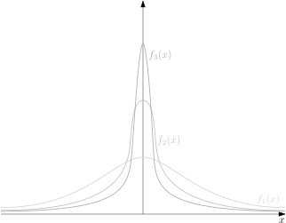

# Convergence of measurable functions {#sec:convergence}

Convergence is related to approximation, and as such it is at the core
of Measure Theory and Probability Theory. To say that a number $x$ is
close to a fixed number $y$ has a unique meaning: their difference is
small. More precisely, $x_n \to y$ if $|x_n-y|$ can be made as small as
possible by requiring $n$ to be large.

The situation becomes considerably more involved when we replace numbers
by functions. If we are considering Borel functions $f_n$ and $g$ on a
measure space $(\Omega,\mathcal{F},\mu)$, or random variables $X_n$ and
$Y$ that can be observed on a given probabilistic model, there are
several different notions of convergence, each one with their own
meaning and implications.

## Modes of convergence {#sub:borelconvergence}

### Convergence of Borel functions

::: {.definition name="a.e. convergence"}
Let $(\Omega,\mathcal{F},\mu)$ be a
measure space and $(f_n)_{n\geqslant 1}, f$ be Borel functions. We say
that *$(f_n)_{n\geqslant 1}$ converges to $f$ $\mu$-a.e.* if $$\nonumber
\mu\{\omega:f_n(\omega) \not\to f(\omega)\} = 0.$$ Then, we write
$f_n \xrightarrow{\text{a.e.}} f$. The measure $\mu$ is implicit in the
notation.
:::

Let us consider another closely-related definition and then move to some
examples to see how they compare.

::: {.definition name="Convergence in measure"}
Let $(\Omega,\mathcal{F},\mu)$ be a measure space and
$(f_n)_{n\geqslant 1}, f$ be Borel functions. We say that
*$(f_n)_{n\geqslant 1}$ converges to $f$ in measure* if for all
$\varepsilon>0$, $$\nonumber
\lim_{n\to\infty}\mu\{|f_n - f| > \varepsilon\} = 0.$$ Then, we write
$f_n \xrightarrow{\mu} f$.
:::

:::{.example}
Consider the measure space $([0,1],\mathcal{B}([0,1]),m_{|_{[0,1]}})$
and $(f_n)_{n\geqslant 1}$ a sequence of Borel functions given by
$$\nonumber
f_n(x) = \dsone_{[0,\frac{1}{n})}, \ x \in [0,1], \ n \geqslant 1.$$
Then, we can see that $$\nonumber
m_{|_{[0,1]}}(f_n \not\to 0) = m_{|_{[0,1]}}(\{0\}) = 0,$$ and so,
$f_n \xrightarrow{\text{a.e.}} 0$. Moreover, for any $0<\varepsilon<1$,
$$m\{|f_n|>\varepsilon\} = \frac{1}{n} \to 0,$$ and for
$\varepsilon \geqslant 1$ this measure is zero for all $n$, so
$f_n \xrightarrow{m} 0$.
:::

:::{.example #travelingwave name="Travelling wave"}
Consider the measure space $(\mathbb{R},\mathcal{B}(\mathbb{R}),m)$, and
consider the sequence of Borel functions $(f_n)_{n\geqslant 1}$, where
$f_n = \dsone_{[n,n+1)}$, which resembles a travelling wave. Notice
that $f_n(x) \to 0$ for every $x$, in particular $f_n(x) \to 0$ for
a.e. $x$. However, we have that $$\nonumber
m\{|f_n| \geqslant\varepsilon\} = 1 \not\to 0
%\int_\Omega |f_n|^p \,\dd m = 1, \ \forall p \geq 1,$$ for
$\varepsilon=\frac{1}{2}$, which implies that $f_n$ does not converge to
$0$ in measure.
:::

:::{.example #dancingwave name="Dancing wave"}
Consider the probability space
$(\mathbb{R},\mathcal{B}(\mathbb{R}),m_{|_{[0,1]}})$, and consider the
sequence of Borel functions $(f_{n,k})_{n\geqslant 0}$, where
$f_{n,k} = \dsone_{(\frac{k}{2^n},\frac{k+1}{2^n}]}, \ k = 0,\dots,2^n-1$,
which resembles a dancing wave.
Figure\ \@ref(fig:dancingwave) illustrates the construction of $f_{n,k}$.

```{r dancingwave, fig.alt="TO DO", fig.cap="First elements of the 'dancing wave'", fig.align='center', echo=FALSE, out.width="80%", fig.pos="H"}

```

As $n$ gets larger, each sub-interval gets shorter, so that for any
$0<\varepsilon<1$ and any $p\geqslant 1$, we have $$\nonumber
%\int_\Omega |f_{n,k}|^p \,\dd m =
m\{(\tfrac{k}{2^n},\tfrac{k+1}{2^n}]\}
=
2^{-n} \to 0$$ On the other hand, given $n\geqslant 0$, letting $k$
range from $0$ to $2^n-1$ ensures that $f_{n,k}$ still oscillates
between $0$ and $1$ for every $x\in(0,1]$. We now order the pairs
$(n,k)$ sequentially as follows. For each $j \geqslant 1$, there is a
unique pair $n \geqslant 0$ and $0 \leqslant k < 2^n$ such that
$j = 2^n + k$. Write $g_j$ for the corresponding $f_{n,k}$. From the
above observations, $g_j \to 0$ in measure as $j\to\infty$, but the set
of $x$ such that $g_j(x)$ converges does not contain points in $(0,1]$.
:::

::: {.definition}
**(Convergence in the vector space $\mathcal{L}^p$)**. Let
$(\Omega,\mathcal{F},\mu)$ be a measure space. For $p\geqslant 1$, we
define $\mathcal{L}^p(\mu)$ as the space of Borel functions $f$ such
that $\int_\Omega|f|^p \,\mathrm{d}\mu<\infty$. Given $f$ and
$(f_n)_{n\geqslant 1}$ in $\mathcal{L}^p(\mu)$, we say that
*$(f_n)_{n\geqslant 1}$ converges to $f$ in $\mathcal{L}^p$* if
$$\nonumber
\lim_{n\to\infty}\int_\Omega |f_n - f|^p \,\mathrm{d}\mu = 0.$$ In this
case, we write $f_n \xrightarrow{\mathcal{L}^p} f$.
:::

:::{.remark}
To see that $\mathcal{L}^p$ is a vector space, use
$|f+g|^p \leqslant|2f|^p + |2g|^p$.
:::

:::{.example #dancing2 name="Dancing wave revisited"}
Consider the 'growing dancing wave' given by $\tilde{f}_{n,k} = 2^{n/2} f_{n,k}$, and
define $\tilde{g}_j$ as the corresponding sequence. Then for $p=1$ we
have $$\int_{[0,1]} |\tilde{f}_{n,k}| \,\mathrm{d}m =
2^{-n/2} \to 0
,$$ so $\tilde{g}_j \to 0$ in $\mathcal{L}^1$ as $j\to\infty$. On the
other hand, $$\int_{[0,1]} |\tilde{f}_{n,k}|^2 \,\mathrm{d}m =
1 \not\to 0
,$$ so $\tilde{g}_j \not\to 0$ in $\mathcal{L}^2$ as $j\to\infty$.
:::

:::{.example #tail name="Integrating the tail"}
Let $f(x)=e^{-|x|}$ on $(\mathbb{R},\mathcal{B}(\mathbb{R}),m)$, and take the sequence
$f_n(x) = \frac{1}{n} f(\frac{x}{n})$. We can think of $f_n$ as
'spreading' $f$ by a factor of $n$. Then $f_n(x)\to 0$ for every
$x \in \mathbb{R}$, and $$\int_\mathbb{R}|f_n(x)|^2 \,\mathrm{d}m =
\frac{1}{n}
\int_\mathbb{R}|f(x)|^2 \,\mathrm{d}m
\to 0
,$$ so $f_n \to 0$ in $\mathcal{L}^2$ as $n\to\infty$. On the other
hand, $$\int_\mathbb{R}|f_n(x)| \,\mathrm{d}m =
\int_\mathbb{R}|f(x)| \,\mathrm{d}m
= 2 \not\to 0
,$$ so $f_n \not\to 0$ in $\mathcal{L}^1$ as $n\to\infty$. Note that for
every $t\in\mathbb{R}$, $0 \leqslant f_n(t)\leqslant\frac{1}{n}$, so
$f_n \xrightarrow{a.e.} 0$.
:::

### Convergence of random variables

When the measure spaces are probability spaces, we use terminology more
suitable to random variables. To this end, let
$(\Omega,\mathcal{F},\mathbb{P})$ be a probability space and
$(X_n)_{n\geqslant 1}, X$ be random variables.

i.  We say that *$(X_n)_{n\geqslant 1}$ converges to $X$
    $\mathbb{P}$-a.s.* if $$\nonumber
    \mathbb{P}(\lim_{n\to\infty}X_n = X) = 1.$$ In this case, we write
    $X_n \xrightarrow{\text{a.s.}} X$ (the measure $\mathbb{P}$ is
    implicit).

i.  We say that *$(X_n)_{n\geqslant 1}$ converges to $X$ in
    probability*, if, for every $\varepsilon > 0$, $$\nonumber
    \lim_{n\to\infty}\mathbb{P}(|X_n - X| > \varepsilon) = 0.$$ In this
    case, we write $X_n \xrightarrow{\mathbb{P}} X$.

i.  Finally, we say that *$(X_n)_{n\geqslant 1}$ converges to $X$ in
    $\mathcal{L}^p$* (or in $p$-th moment) if
    $X \in \mathcal{L}^p(\mathbb{P}), \ p \in [1,\infty)$, i.e.
    $\mathbb{E}|X|^p < \infty,$ and $$\nonumber
    \lim_{n\to\infty}\mathbb{E}|X_n - X|^p = 0.$$ In this case, we write
    $X_n \xrightarrow{\mathcal{L}^p} X$.

:::{.remark}
For a probability space, if $X_n \xrightarrow{\mathcal{L}^p} X$, then
$\mathbb{E}X_n \to \mathbb{E}X$.
:::

::: {.proof}
Using Exercise \@ref(exr:intnorm) and Jensen's inequality: $$\nonumber
\big| \mathbb{E}X_n - \mathbb{E}X \big|^p
\leqslant
\big( \, \mathbb{E}|X_n-X| \, \big)^p
\leqslant
\mathbb{E}| X_n - X |^p 
\to 0.$$
:::

Recall that a random variable $X$ on a probability space
$(\Omega,\mathcal{F},\mathbb{P})$ is equipped with a cumulative
distribution function
$F_X(x) = \mathbb{P}(X \leqslant x), \ x\in\mathbb{R}$. In particular,
we can discuss convergence of a sequence of random variables via their
distribution functions.

::: {.definition #convdistr name="Convergence in distribution"}
Let $(\Omega,\mathcal{F},\mathbb{P})$ be a probability space and
$(X_n)_{n\geqslant 1}$ and $X$ be random variables with
$(F_{X_n})_{n\geqslant 1}$ and $F_X$ their corresponding distribution
functions. We say that *$(X_n)_{n\geqslant 1}$ converges to $X$ in
distribution* if $$\nonumber
\lim_{n\to\infty}F_{X_n}(x) = F_X(x),$$ for every point $x\in\mathbb{R}$
at which $F_X$ is continuous. Then, we write $X_n \xrightarrow{d} X$.
:::

:::{.remark}
Convergence in distribution is only concerned with the associated
distribution functions. In particular, a sequence of random variables
$(X_n)_{n\geqslant 1}$ converging in distribution to some random
variable $X$ might even be defined on a different probability space from
that of $X$.
:::


:::{.example}
Let $(\Omega,\mathcal{F},\mathbb{P})$ be a probability space and
$(X_n)_{n\geqslant 1}$ a sequence of random variables, each Geometric
distributed with probability of success $p_n$, that is, $$\nonumber
F_{X_n}(x) = 1 - (1 - p)^{x}, \ x\in\mathbb{N}, \ n \geqslant 1.$$
Further, assume that $n p_n \to \lambda > 0$, as $n \to \infty$. We
would like to show that $(\frac{X_n}{n})_{n\geqslant 1}$ converges in
distribution to the exponential distribution with parameter $\lambda$.
First, for $x \in [0,\infty)$ and $n \geqslant 1$, we can write
$$\begin{gathered}
F_{\frac{X_n}{n}}(x) = \mathbb{P}(X_n \leqslant n x) = \mathbb{P}(X_n \leqslant\lfloor{n x}\rfloor) = \\ = 1 - (1 - p_n)^{\lfloor{n x}\rfloor} = 1 - (1 - \frac{n p_n}{n})^{nx}(1 - \frac{n p_n}{n})^{\lfloor{n x}\rfloor - nx}.\end{gathered}$$
Now, by observing that $$\nonumber
(1 - \frac{n p_n}{n})^{nx} \xrightarrow{n\to\infty} e^{-\lambda x} \quad \text{and} \quad (1 - \frac{n p_n}{n})^{\lfloor{n x}\rfloor - nx} \xrightarrow{n\to\infty} 1,$$
we get $$\nonumber
F_{\frac{X_n}{n}}(x) \xrightarrow{n\to\infty} 1 - e^{\lambda x},$$ where
the limiting distribution is precisely that of the exponential
distribution with parameter $\lambda$, and so we are done.
:::

:::{.example}
Let $(\Omega,\mathcal{F},\mathbb{P})$ be a probability space and
$(X_n)_{n\geqslant 1}$ a sequence of random variables, each with
$\frac{1}{n}$ and $1$ being equiprobable outcomes, that is, $$\nonumber
\mathbb{P}(X_n = \frac{1}{n}) = \mathbb{P}(X_n = 1) = \frac{1}{2}, \ n \geqslant 1.$$
Under this construction, we can expect that $(X_n)_{n\geqslant 1}$
converges in distribution to a Bernoulli random variable $X$ with
parameter $\frac{1}{2}$. Indeed, for each $x \in \mathbb{R}$, we have
$$\nonumber
F_{X_n}(x) =
\begin{cases}
0, & x < \frac{1}{n} \\
\frac{1}{2}, & x \in [\frac{1}{n},1) \\
1, & x \geqslant 1
\end{cases}
\quad \xrightarrow[{n\to\infty}]{} \quad
\begin{cases}
0, & x \leqslant 0 \\
\frac{1}{2}, & x \in (0,1) \\
1, & x \geqslant 1
\end{cases}$$ where the right hand side is precisely the distribution
function of $X$, except at $x = 0$. But this is a discontinuity point of
$F_X$, so we can still deduce that $X_n \xrightarrow{d} 0$.
:::

:::{.example}
Let $(\Omega,\mathcal{F},\mathbb{P})$ be a probability space and
$(X_n)_{n\geqslant 1}$ be a sequence of random variables, each Cauchy
distributed with location parameter $0$ and scale parameter
$\frac{1}{n}$, that is, $$\nonumber
f_{X_n}(x) = \frac{1}{\frac{1}{n}\pi(1 + n^2x^2)} = \frac{n}{\pi(1+n^2x^2)}, \ x \in \mathbb{R}, \ n \geqslant 1.$$
From Figure\ \@ref(fig:cauchy), we can see that as $n$ gets larger,
$f_{X_n}(x)$ becomes closer to $f(x) = 0$, so we claim that
$(X_n)_{n\geqslant 1}$ converges in distribution to $0$. For
$x \in \mathbb{R}$ and $n \geqslant 1$, we have $$\begin{gathered}
F_{X_n}(x) = \mathbb{P}(X_n \leqslant x) = \int_{-\infty}^{x} \frac{n}{\pi(1 + n^2 y^2)} \,\mathrm{d}y = \\ = \left[\frac{\arctan(n y)}{\pi}\right]_{-\infty}^{x} = \frac{1}{2} + \frac{\arctan(n x)}{\pi}\end{gathered}$$
Now, taking limit as $n \to \infty$ gives $$\nonumber
\lim_{n\to\infty} F_{X_n}(x) =
\begin{cases}
0, & x < 0 \\
\frac{1}{2}, & x = 0 \\
1, & x > 0
\end{cases}$$ where the limiting distribution is that of a constant
$X = 0$ random variable, except at $x = 0$, which is a point of
discontinuity of $F_X$, and hence we can still deduce that
$X_n \xrightarrow{d} 0$.

```{r cauchy, fig.alt="TO DO", fig.cap="Probability density function of Cauchy distribution with location parameter $0$ and scale parameter $n = 1, \\frac{1}{2}, \\frac{1}{3}$", fig.align='center', echo=FALSE, out.width="60%", fig.pos="H"}

```

In addition, we show convergence in probability. For each
$\varepsilon > 0$, we have $$\nonumber
\mathbb{P}(|X_n| > \varepsilon) = 2 \int_\varepsilon^\infty \frac{n}{\pi(1 + n^2x^2)} \,\mathrm{d}x = 2 \left[\frac{\arctan(nx)}{\pi}\right]_{\varepsilon}^{\infty} = 1 - 2\frac{\arctan(n\varepsilon)}{\pi}.$$
Taking limit as $n \to \infty$ yields $$\nonumber
\lim_{n\to\infty}\mathbb{P}(|X_n|>\varepsilon) = 0,$$ thus,
$X_n \xrightarrow{\mathbb{P}} 0$.
:::

:::{.remark}
In the above example, convergence in distribution follows from
Proposition\ \@ref(prp:probdistr) that we will see later on.
:::

::: {.theorem #testdist name="Convergence in distribution in terms of test functions"}
For a family of random variables $X$ and $(X_n)_n$, we have
$X_n \xrightarrow{d} X$ if and only if
$\mathbb{E}f(X_n) \to \mathbb{E}f(X)$ for every bounded continuous
function $f:\mathbb{R}\to\mathbb{R}$.
:::

::: {.proof}
See [@Kle14 Theorem 13.23].
:::

We shall later see that convergence in distribution is the weakest among
these modes of convergence. However, it is quite often useful in
practice.

## Almost sure convergence and Borel-Cantelli

To get to convergence of real-valued random variables, for "most" or
"almost all" points $\omega \in \Omega$, we need a systematic way of
representing convergence $X_n \to X$ in terms of certain events that are
amenable to study.

### Infinitely often and eventually

::: {.definition #infoften name="Infinitely often and eventually"}
Suppose $(\Omega,\mathcal{F})$ is a measurable space and $(A_n)_{n\geqslant 1}$
is a sequence of events (i.e. measurable sets). We define the event
"$A_n$ infinitely often," abbreviated "$A_n$\ i.o.," also denoted
$\limsup\limits_{n\to\infty} A_n$, as $$\nonumber
\limsup_{n\to\infty} A_n := \bigcap_{n=1}^{\infty}\bigcup_{m=n}^{\infty}A_m
.$$ This event is the set of all $\omega$ such that $\omega \in A_n$ for
infinitely many $A_n$'s, that is, the set of $\omega$ such that, for all
$n \geqslant 1$ there exists $m \geqslant n$ such that $\omega \in A_m$.
Occurrence of the event $\limsup_n A_n$ means that infinitely many
events among $\{A_n\}_n$ occur.

We define the event "$A_n$ eventually," also denoted
$\liminf\limits_{n\to\infty} A_n$, as $$\nonumber
\liminf_{n\to\infty} A_n := \bigcup_{n=1}^{\infty}\bigcap_{m=n}^{\infty}A_m$$
This event is the set of all $\omega$ such that $\omega \in A_n$ for all
but finitely many $A_n$'s, that is, the set of $\omega$ such that, for
some $n \geqslant 1$ and all $m \geqslant n$ one has $\omega \in A_m$.
Occurrence of the event $\limsup_n A_n$ means that all but finitely many
events among $\{A_n\}_n$ occur.
:::

:::{.remark}
By De Morgan's laws, we have $$\nonumber
\{A_n \ \text{i.o.}\}^c =
\{A_n^c \ \text{eventually}\}
\quad
\text{ and }
\quad
\{A_n^c \ \text{i.o.}\} =
\{A_n \ \text{eventually}\}^c
.$$
:::

:::{.exercise}
Prove the above identities.
:::

Let us point out already how the notions of eventually and infinitely
often are related to convergence. A sequence of numbers $(x_n)_n$
converges to a number $x$ if, for every $\varepsilon>0$, we have
$|x_n-x|<\varepsilon$ for all $n$ sufficiently large, which means
$|x_n-x|<\varepsilon$ for all but finitely many $n$'s, which means
$|x_n-x|<\varepsilon$ eventually. Likewise, $x_n \not\to x$ if for some
$\varepsilon>0$ we have $|x_n-x| \geqslant\varepsilon$ infinitely often.

::: {.proposition #aecriterion name="Criterion for a.e. convergence"}
Let $(\Omega,\mathcal{F},\mu)$ be a measure space and
$(f_n)_{n\geqslant 1}, f$ be Borel functions. Then,
$(f_n)_{n\geqslant 1}$ converges to $f$ $\mu$-a.e., if and only if
$$\nonumber
\mu \big(\{|f_n - f| \geqslant\varepsilon \ \text{i.o.}\} \big) = 0
\text{ for all }
\varepsilon>0
.$$
:::

::: {.proof}
We have the following chain of equivalent properties:
$$\begin{aligned}
\mu\{f_n \not\to f\}
&=0
\\
&
\Updownarrow
{\text{ definition of limit }}
\\
\mu\{\exists \varepsilon>0, |f_n-f|\geqslant\varepsilon \text{ i.o.}\}
&=0
\\
&
\Updownarrow
\text{ take  $ \tfrac{1}{k+1}<\varepsilon\leqslant\tfrac{1}{k} $ }
\\
\mu\{\exists k\in\mathbb{N}, |f_n-f|\geqslant\tfrac{1}{k} \text{ i.o.}\}
&=0
\\
&
\Updownarrow
\text{ continuity from below of $ \mu $ }
\\
\lim_{k\to\infty} \mu\{ |f_n-f|\geqslant\tfrac{1}{k} \text{ i.o.}\}
&=0
\\
&
\Updownarrow
\text{ non-decreasing numbers }
\\
\forall k\in\mathbb{N}, \mu\{ |f_n-f|\geqslant\tfrac{1}{k} \text{ i.o.}\}
&=0
\\
&
\Updownarrow
\text{ take  $ \tfrac{1}{k+1}<\varepsilon\leqslant\tfrac{1}{k} $ }
\\
\forall \varepsilon>0, \mu\{ |f_n-f|\geqslant\varepsilon \text{ i.o.}\}
&=0
.\end{aligned}$$ This completes the proof.
:::

### Borel-Cantelli lemmas

From the above proposition, we have enough motivation to try and
estimate the probability that a sequence of events occur infinitely
often.

::: {.lemma name="Borel-Cantelli Lemma I"}
Let $(\Omega,\mathcal{F},\mu )$ be a measure space and 
$(A_n)_{n\geqslant 1}$ a sequence of measurable
sets. If $$\sum_{n=1}^{\infty}\mu (A_n) < \infty,$$ then
$$\mu \big( \limsup{}_{n} \, A_n \big) = 0.$$
:::

::: {.proof}
The idea is to set appropriate upper bounds that converge to
$0$, so as make the relevant conclusions. Using continuity from above
and countable sub-additivity of $\mu$, we have $$\begin{aligned}
\mu (\{A_n \ \text{i.o.}\}) &= \mu \left(\bigcap_{n=1}^{\infty}\bigcup_{m=n}^{\infty}A_m\right) \\
&= \lim_{n\to\infty} \mu \left(\bigcup_{m=n}^{\infty}A_m\right) \\
&\leqslant\lim_{n\to\infty}\sum_{m=n}^{\infty} \mu (A_m) = 0.\end{aligned}$$
The last limit is zero because it is the tail of a convergent series.
:::

::: {.lemma name="Borel-Cantelli Lemma II"}
Let $(\Omega,\mathcal{F},\mathbb{P})$ be a probability space and
$(A_n)_{n\geqslant 1}$ a sequence of independent events. If
$$\sum_{n=1}^{\infty}\mathbb{P}(A_n) = \infty,$$ then
$$\mathbb{P}\big( \limsup{}_{n} \, A_n \big) = 1.$$
:::

::: {.proof}
We look instead at $\{A_n \ \text{i.o.}\}^c$.
By the remark after Definition\ \@ref(def:infoften),
continuity from below and from above,
and independence of $(A_n^c)_{n \geqslant 1}$, we get $$\begin{aligned}
\mathbb{P}(\{A_n \ \text{i.o.}\}^c) &= \mathbb{P}\left(\bigcup_{n=1}^{\infty}\bigcap_{m=n}^{\infty}A_m^c\right) \\
&= \lim_{n\to\infty}\mathbb{P}\left(\bigcap_{m=n}^{\infty}A_m^c\right) \\
&= \lim_{n\to\infty} \lim_{k\to\infty} \mathbb{P}\left(\bigcap_{m=n}^{k}A_m^c\right) \\
&= \lim_{n\to\infty} \lim_{k\to\infty} \prod_{m=n}^{k}(1-\mathbb{P}(A_m)) \\
&\leqslant\lim_{n\to\infty} \lim_{k\to\infty} \prod_{m=n}^{k}e^{-\mathbb{P}(A_m)} \\
&= \lim_{n\to\infty} \lim_{k\to\infty} e^{-\sum_{m=n}^{k}\mathbb{P}(A_m)} = e^{-\infty} = 0,\end{aligned}$$
where the upper bound follows from inequality $1 - x \leqslant e^{-x}$
for $x \geqslant 0$.
:::

:::{.remark}
In practice, we can apply Borel-Cantelli Lemma I to deduce almost
everywhere convergence, that is, if we can show that for every
$\varepsilon > 0$, $$\nonumber
\sum_{n=1}^{\infty} \mu \big( |f_n-f| \geqslant\varepsilon \big)  < \infty$$
then by
Proposition\ \@ref(prp:aecriterion) we can conclude that
$f_n \xrightarrow{\text{a.e.}} f$.
:::

:::{.example}
Let $(\Omega,\mathcal{F},\mathbb{P})$ be a probability space and
$(X_n)_{n\geqslant 1}$ be a sequence of independent random variables,
each uniformly distributed on $[0,1]$. Consider the sequence of random
variables $(Y_n)_{n\geqslant 1}$ given by $$\nonumber
Y_n = \min\{X_1,\dots,X_n\}, \ n\geqslant 1.$$ We show that
$Y_n \xrightarrow{\text{a.s.}} 0$. Given $n \in \mathbb{N}$,
independence and construction of $X_1,\dots,X_n$ for each
$\varepsilon \in (0,1)$ yields $$\begin{aligned}
\mathbb{P}(|Y_n - Y| \geqslant\varepsilon) = \mathbb{P}(|Y_n| > \varepsilon) &= \mathbb{P}(X_1 > \varepsilon,\dots,X_n > \varepsilon) \\
&= \mathbb{P}(X_1 > \varepsilon)^n \\
&= (1-\varepsilon)^n,\end{aligned}$$ and consequently, we get that
$$\nonumber
\sum_{n=1}^{\infty}\mathbb{P}(|Y_n| \geqslant\varepsilon) = \sum_{n=1}^{\infty}(1-\varepsilon)^n = \frac{1-\varepsilon}{\varepsilon} < \infty.$$
Hence, for each $\varepsilon\in(0,1)$, by Borel-Cantelli Lemma I, it
follows that $$\nonumber
\mathbb{P}(\{|Y_n| > \varepsilon \ \text{i.o.}\}) = 0,$$ so by
Proposition\ \@ref(prp:aecriterion), we have
$Y_n \xrightarrow{\text{a.s.}} 0$.
:::

:::{.exercise}
Let $(\Omega,\mathcal{F},\mathbb{P})$ be a probability space and
$(X_n)_{n\geqslant 1}$ be a sequence of random variables with
probability distribution given by $$\nonumber
\mathbb{P}(X_n = a_n) = p_n \quad \text{and} \quad \mathbb{P}(X_n = 0) = 1 - p_n, \quad n\geqslant 1,$$
for sequences $(a_n)_n$ and $(p_n)_n$ with
$\sum_{n=1}^{\infty}p_n < \infty$. Show that
$X_n \xrightarrow{\text{a.s.}} 0$.
:::

:::{.example}
Suppose $a_n \uparrow \infty$ and $p_n \downarrow 0$ with
$\sum_n p_n = \infty$, and that $(X_n)_n$ is a sequence of independent
random variables distributed as $$\nonumber
\mathbb{P}(X_n = a_n) = p_n \quad \text{and} \quad \mathbb{P}(X_n = 0) = 1 - p_n, \quad n\geqslant 1.$$
Then $\mathbb{P}(X_n \to 0)=0$ but $X_n \overset{\mathbb{P}}{\to} 0$ as
$n \to \infty$.
:::

:::{.remark}
When applying Borel-Cantelli Lemma II to argue that almost sure
convergence does not hold, we must be careful to check independence of
the concerned random variables.
:::

:::{.example}
Let $(\Omega,\mathcal{F},\mathbb{P})=([0,1],\mathcal{B},m_{|_{[0,1]}})$,
$X_n(\omega)=\dsone_{[0,\frac{1}{n}]}(\omega)$ and
$X(\omega)=0\ \forall\omega$. Then $\mathbb{P}(X_n \to 0)=1$ since
$X_n(\omega)\to 0$ for all $\omega \ne 0$. However,
$\mathbb{P}(X_n=1)=\frac{1}{n}$ which is non-summable. If we used the
same reasoning as in the previous example, without noticing that the
variables $(X_n)_n$ are dependent, we would conclude that
$\mathbb{P}(X_n \to 0)=0$, which is false.
:::

::: {.proposition #limsup}
If $\mathbb{P}(A_n \text{ i.o.})=0$ then $\mathbb{P}(A_n)\to 0$ as $n\to\infty$.
:::

::: {.proof}
Suppose $\mathbb{P}(A_n \text{ i.o.})=0$, and take
$B_k = \cup_{n\geqslant k}A_n$. Since
$B_k \downarrow [A_n \mbox{ i.o.}]$ as $k\to\infty$, we have
$\mathbb{P}(B_k) \to \mathbb{P}(A_n \mbox{ i.o.})=0$. On the other hand,
$B_k \supseteq A_k$, thus $\mathbb{P}(A_k) \leqslant\mathbb{P}(B_k)$,
and therefore $\mathbb{P}(A_n)\to 0$ as $n\to\infty$.
:::

## Laws of Large Numbers

The topic of Laws of Large number dispenses introductions.

Let $X_1,X_2,X_3,\dots$ be a sequence of random variables. Define
$$S_n := X_1 + \dots + X_n .$$ We say that the sequence $(X_n)_n$
satisfies the law of large numbers if
$$\frac{S_n - \mathbb{E}S_n}{n} \to 0$$ as $n \to \infty$. We say that
$(X_n)_n$ satisfies weak LLN if the above convergence is in probability,
and the strong LLN in case convergence is almost-sure.

### Laws of Large Numbers with second and fourth moments

::: {.theorem name="Chebyshev's Weak Law of Large Numbers"}
Let $(X_n)_n$ be a sequence of random variables such that $\mathrm{Cov}(X_i,X_j) = 0$ for
every $i \ne j$ and $\sup_n \mathbb{V}X_n < \infty$. Then $(X_n)_n$
satisfies the weak law of large numbers.
:::

::: {.proof}
By Chebyshev's
inequality \@ref(eq:chebyshev), $$\nonumber
\mathbb{P}\left( \left| \frac{S_{n}-\mathbb{E}S_{n}}{n}\right| \geqslant\varepsilon \right)
\leqslant
\frac{\mathbb{V}(\frac{S_n}{n})}{\varepsilon^2}
=
\frac{\mathbb{V}S_n}{\varepsilon^2 n^2}
=
\frac{\sum_{i=1}^n \mathbb{V}X_i}{\varepsilon^2 n^2}
\leqslant
\frac{n\cdot \sup_k \mathbb{V}X_k}{\varepsilon^2 n^2}
\rightarrow 0
,$$ concluding the proof.
:::

::: {.theorem name="Cantelli's Strong Law of Large Numbers"}
Let $X_{1},X_{2},\dots$ be independent random variables such that
$\sup_n \mathbb{E}X_n^4 < \infty$. Then $(X_n)_n$ satisfies the strong
law of large numbers.
:::

::: {.proof}
We can suppose that $\mathbb{E}X_k = 0$ for all $k$. Expand
$S_n^4$ as $$\begin{gathered}
S_n^4
=
(X_1+\cdots+X_n)^4
=
\sum_{i,j,k,l} X_i X_j X_k X_l
=
\sum_{i} X_i^4
+
\frac{4!}{2!2!}
\sum_{i < j} X_i^2 X_j^2
+
\\
+
\frac{4!}{3!}
\sum_{i \ne k} X_i^3 X_k
+
\frac{4!}{2!}
\sum_{\stackrel{j < k}{i\ne j,k}} X_i^2 X_j X_k
+
4!
\sum_{\quad i < j < k < l} X_i X_j X_k X_l
.\end{gathered}$$ By independence, we have $$\begin{gathered}
\mathbb{E}S_n^4 =
\sum_{i} \mathbb{E}X_i^4
+
6 \sum_{i < j} \mathbb{E}[X_i^2 X_j^2]
+
\\
+
\sum_k
\mathbb{E}
\left[
\Big.
4
\sum X_i^3
+
12
\sum X_i^2 X_j
+
24
\sum X_i X_j X_l
\right]
\mathbb{E}X_k
.\end{gathered}$$ Since $\mathbb{E}X_k=0$, the second row is zero. Write
$M := \sup_k \mathbb{E}X_k^4 < \infty$. By the Cauchy-Schwarz
inequality, $\mathbb{E}(X_i^2 X_j^2) \leqslant\sqrt{M}\sqrt{M} = M$.
Hence, $$\begin{aligned}
\mathbb{E}S_n^4
\leqslant
n M + 6 \tbinom{n}{2} M
=
(3n^2 - 2n) M
\leqslant
3n^2 M.\end{aligned}$$ By Markov's inequality, we have $$\nonumber
\mathbb{P}\left( \left| \tfrac{S_{n}}{n}\right| \geqslant\varepsilon \right)
\leqslant
\frac{\mathbb{E}S_n^4}{\varepsilon^4 n^4}
\leqslant
\frac{3 M}{\varepsilon^4 n^2},$$ and by Borel-Cantelli Lemma I we get
$\frac{S_n}{n} \xrightarrow{\mathrm{a.s.}} 0$.
:::

### Laws of Large Numbers with first moment

::: {.theorem name="Komogorov's Strong Law of Large numbers"}
Let $X_1, X_2, \dots$ be pairwise independent and identically distributed
integrable random variables. Then $(X_n)_n$ satisfies the strong law of
large numbers.
:::

::: {.proof}
See [@Kle14 Theorem 5.17] for the proof found by Etemadi in 1981.
:::

It should be emphasised that, when $(X_n)_n$ are i.i.d., the condition
of $X_1$ being integrable is the weakest possible. It is in fact
equivalent to $\frac{X_1 + \dots + X_n}{n} \stackrel{a.s.}{\to} \mu$ for
some $\mu \in \mathbb{R}$, as shown by the following proposition.

::: {.proposition}
Suppose $(X_n)_n$ are i.i.d.and not integrable.
Then, a.s., the sequence $\frac{S_n}{n}$ does not converge to any real
number.
:::

::: {.proof}
For every fixed $k \in \mathbb{N}$, the variable
$\frac{X_1}{k}$ is not integrable. Since $(X_n)_n$ are identically
distributed, by
Proposition\ \@ref(prp:inttest) we have
$$\sum_n \mathbb{P}(\tfrac{|X_n|}{k} \geqslant n) = \sum_n \mathbb{P}(\tfrac{|X_1|}{k} \geqslant n) = \infty .$$
By Borel-Cantelli Lemma II, almost surely the event $|X_n| \geqslant kn$
occurs for infinitely many values of $n$. Taking the complement and
union over $k$, we get $$\nonumber
\mathbb{P}
\big(
\text{for every }
k,\ |X_n| \geqslant kn
\text{ for infinitely many values of }
n
\big)
=1
.$$

We now show that, for a sequence $(x_n)_n$ satisfying the above
condition, we have $\limsup_n |\frac{s_n}{n}| = +\infty$, where
$s_n := {x_1 + \dots + x_n}$. This implies the proposition.

So we have to show that, for every $r \in \mathbb{N}$, there exists $m$
such that ${|\frac{s_{m}}{m}|} \geqslant r$. Suppose $(x_n)_n$ satisfies
the above condition and let $r \in \mathbb{N}$ be given. Take $k = 2r$
and $n$ such that $|x_n| \geqslant kn$. If
${|\frac{s_{n-1}}{n-1}|} \geqslant r$, we take $m=n-1$ and we are done.
So suppose ${|\frac{s_{n-1}}{n-1}|} \leqslant r$. Then
$$\begin{gathered}
\frac{|x_1+\dots+x_n|}{n}
\geqslant
\frac{|x_n|}{n}
-
\frac{|x_1+\dots+x_{n-1}|}{n}
\geqslant
\\
\geqslant
\frac{|x_n|}{n}
-
\frac{|x_1+\dots+x_{n-1}|}{n-1}
\geqslant
\frac{|x_n|}{n}
-
r
\geqslant
k-r
=
r
,\end{gathered}$$ and we can take $m=n$. This concludes the proof.
:::

## Relation between modes of convergence

### Almost-sure convergence and subsequences

::: {.proposition #aesubseq name="Convergence in measure implies a.e.in a
subsequence"}
Let $(\Omega,\mathcal{F},\mu)$ be a measure space and $(f_n)_{n\geqslant 1}, f$ Borel functions with
$f_n \xrightarrow{\mu} f$. Then, there exists a subsequence such that
$f_{n_k} \xrightarrow{\text{a.e.}} f$ as $k \to \infty$.
:::

::: {.proof}
First for each $n \geqslant 1$ and $k \in \mathbb{N}$, set
$A_{n,k} := \{|f_n - f| > \frac{1}{k}\}$. Since
$f_n \xrightarrow{\mu} f$, then for each $k \in \mathbb{N}$, $$\nonumber
\lim_{n\to\infty} \mu(A_{n,k}) = \lim_{n\to\infty} \mu(|f_n - f| > \tfrac{1}{k})= 0.$$
In other words, for each $k \in \mathbb{N}$, there exists
$n_k \in \mathbb{N}$ such that for any $n \geqslant n_k$, $$\nonumber
\mu(A_{n,k}) = \mu(|f_{n} - f| > \tfrac{1}{k}) < \tfrac{1}{k^2}.$$ We
can also assume that $n_k > n_{k-1}$ for $k \geqslant 2$. Set
$B_k := A_{n_k,k}$, and notice that $$\nonumber
\sum_{k=1}^{\infty} \mu(B_k) < \sum_{k=1}^{\infty} \frac{1}{k^2} < \infty,$$
and so $\mu(B_k \ \text{i.o.}) = 0$ by Borel-Cantelli Lemma I, thus
$f_{n_k} \xrightarrow{\text{a.e.}} f$, as $k \to \infty$.
:::

Convergence a.e. does not imply convergence in measure, as shown in
Example\ \@ref(exm:travelingwave). However, this is the case in finite
measure spaces.

::: {.proposition #asimpliesprobab name="a.s. convergence implies convergence in probability"}
Let $(\Omega,\mathcal{F},\mathbb{P})$ be a probability space and
$(X_n)_{n\geqslant 1}, X$ be random variables. If $X_n \to X$ a.s. as
$n\to\infty$, then $X_n \to X$ in probability as $n\to\infty$.
:::

::: {.proof}
Since $X_n \xrightarrow{\text{a.s.}} X$, by
Proposition\ \@ref(prp:aecriterion), we have $$\nonumber
\mathbb{P}(|X_n - X| \geqslant\varepsilon \ \text{i.o.}) = 0, \ \forall \varepsilon > 0.$$
Then, we can apply
Proposition\ \@ref(prp:limsup) to get $$\nonumber
\lim_{n\to\infty} \mathbb{P}(|X_n - X| \geqslant\varepsilon) = 0, \ \forall \varepsilon > 0,$$
so that $X_n \xrightarrow{\mathbb{P}} X$, as required.
:::

### Convergence in $\mathcal{L}^p$ and in expectation

::: {.proposition #ellpmeasure}
*(Convergence in $\mathcal{L}^p$ implies convergence in measure)*. 
Let $(\Omega,\mathcal{F},\mu)$ be a measure space and
$(f_n)_{n\geqslant 1}, f$ be Borel functions. If $f_n \to f$ in
$\mathcal{L}^p$ as $n\to\infty$, then $f_n \to f$ in measure as
$n\to\infty$.
:::

::: {.proof}
Since $f_n \xrightarrow{\mathcal{L}^p} f$, for some
$p \geqslant 1$, then $$\nonumber
\lim_{n\to\infty}\int_\Omega |f_n - f|^p \,\mathrm{d}\mu = 0.$$ By
Chebyshev's inequality
(Theorem\ \@ref(thm:chebyshev)), for all $\varepsilon > 0$, it follows that
$$\nonumber
\mu(|f_n - f| > \varepsilon) \leqslant\frac{1}{\varepsilon^p}\int_\Omega |f_n-f|^p \,\mathrm{d}\mu \xrightarrow{n\to\infty} 0,$$
thus $f_n$ converges to $f$ in measure,
i.e.$f_n \xrightarrow{\mu} f$.
:::

::: {.proposition #lqimpliespp}
*(Comparison of $\mathcal{L}^p$ and $\mathcal{L}^q$)*.
For a probability space, if $q \geqslant p \geqslant 1$ and
$X_n \xrightarrow{\mathcal{L}^q} X$, then
$X_n \xrightarrow{\mathcal{L}^p} X$.
:::

::: {.proof}
The proof goes as follows: $$\nonumber
( \mathbb{E}|X_n-X|^p )^{1/p}
\leqslant
( \mathbb{E}|X_n-X|^q )^{1/q}
\to 0
,$$ so we only need to justify the first inequality. Let $Y$ be a
non-negative random variable. Take $(Z_n)_n$ as integrable random
variables such that $0 \leqslant Z_n \uparrow Y^p$ (for instance,
$Z_n = \min\{Y,n\}^p$). The function $f:[0,\infty) \to [0,\infty)$ given
by $f(x)=x^{q/p}$ is convex. Hence, by Jensen's inequality, we have
$$\nonumber
(\mathbb{E}Z_n)^{q/p} \leqslant\mathbb{E}Z_n^{q/p} \leqslant\mathbb{E}Y^{q}.$$
Now, we can conclude that $(\mathbb{E}Y^p)^{q/p} \leqslant\mathbb{E}Y^q$
by the Monotone Convergence Theorem. This completes the proof.
:::

:::{.example #asnotimplylp}
et $(\Omega,\mathcal{F},\mathbb{P})=([0,1],\mathcal{B},m)$, and take
$X_n = n \dsone_{[0,\frac{1}{n})}$. Then $X_n \to 0$ a.s., but
$\int_\Omega|X_n| \,\mathrm{d}\mathbb{P}= 1$ so $X_n \not\to 0$ in
$\mathcal{L}^p$.
:::

Examples\ \@ref(exm:dancing2)
and \@ref(exm:asnotimplylp) show that neither a.s.convergence implies
convergence in $\mathcal{L}^p$, nor convergence in $\mathcal{L}^p$
implies a.s.convergence. Combined with
Propositions\ \@ref(prp:asimpliesprobab)
and \@ref(prp:ellpmeasure), convergence in probability implies
neither of them.

::: {.theorem #dominatedlp name="Dominated Convergence Theorem revisited"}
Let $(\Omega,\mathcal{F},\mu)$ be a measure space, and
$(f_n)_{n\geqslant 1}$ a sequence of Borel functions such that
$f_n \xrightarrow{\mu} f$. If there exists a non-negative Borel function
$g \in \mathcal{L}^p (\mu)$, $p \in [1,\infty)$, such that
$|f_n| \leqslant g$ for all $n \geqslant 1$, then
$f_n \xrightarrow{\mathcal{L}^p} f$.

If moreover $p=1$ or $\mu$ is a probability measure, then $$\nonumber
\lim_{n\to\infty} \int_{\Omega} f_n \,\mathrm{d}\mu = \int_{\Omega} f \,\mathrm{d}\mu.$$
:::

::: {.proof}
Convergence of the integral follows from
Remark [\[rmk:convexp\]](#rmk:convexp){reference-type="ref"
reference="rmk:convexp"} if $\mu(\Omega)=1$, and from
Exercise\ \@ref(exr:intnorm) if $p=1$, so we only need to prove that
$f_n \to f$ in $\mathcal{L}^p$.

Let us first suppose that $f_n \xrightarrow{\text{a.e.}} f$. By noticing
that
$$|f_n(\omega)-f(\omega)|^p \leqslant 2^p |g(\omega)|^p, \ \omega \in \Omega,$$
we can use Theorem\ \@ref(thm:dct) to deduce that 
\begin{equation}
(\#eq:momentconv)
\lim_{n\to\infty} \int_{\Omega} |f_n - f|^p \,\mathrm{d}\mu = 0.
\end{equation}

Now, let us assume that $f_n \xrightarrow{\mu} f$. Consider a
subsequence $(f_{n_k})_k$. Then $f_{n_k} \xrightarrow{\mu} f$ as
$k \to \infty$. By
Proposition\ \@ref(prp:aesubseq), there is a sub-subsequence $(f_{n_{k_j}})_j$
such that $f_{n_{k_j}} \xrightarrow{\text{a.e.}} f$ as $j \to \infty$.
By the previous case, we have $\int_\Omega|f_{n_{k_j}}-f|^p \to 0$ as
$j \to \infty$. Using
Lemma\ \@ref(lem:convsubsub), we
get \@ref(eq:momentconv), concluding the proof.
:::

### Convergence in distribution

Convergence in distribution is actually the weakest concept, and it is
implied by all modes of convergence.

::: {.proposition #probdistr name="Convergence in probability implies convergence in
distribution"}
Let $(\Omega,\mathcal{F},\mathbb{P})$ be a probability
space and $(X_n)_{n\geqslant 1}, X$ be random variables. If $X_n \to X$
in probability, then $X_n \to X$ in distribution as $n\to\infty$.
:::

::: {.proof}
Let $f : \mathbb{R}\to \mathbb{R}$ be a bounded continuous
function. By Theorem\ \@ref(thm:testdist), it is enough to show that
\begin{equation}
(\#eq:convexptest)
\mathbb{E}f(X_n) \to \mathbb{E}f(X)
\end{equation}
as $n \to \infty$. First, suppose
that $X_n \xrightarrow{\text{a.s.}} X$. Recall that a real function is
continuous if and only if $f(x_n)\to f(x)$ whenever $x_n\to x$. Thus,
$$\{ \omega: X_n(\omega) \to X(\omega) \} \subseteq \{ \omega : f(X_n(\omega)) \to f(X(\omega)) \},$$
and hence $f(X_n) \xrightarrow{\text{a.s.}} f(X)$. Since $f$ is bounded,
$|f(X_n)|\leqslant\sup_{s\in\mathbb{R}}|f(s)| < \infty$ for all
$n \geqslant 1$. Applying
Theorem\ \@ref(thm:dominatedlp) with constant $g$, we
get \@ref(eq:convexptest).

If instead we suppose $X_n \xrightarrow{\mathbb{P}} X$, we can
get \@ref(eq:convexptest) by taking sub-subsequences and invoking
Lemma\ \@ref(lem:convsubsub), as we did in the proof of
Theorem\ \@ref(thm:dominatedlp).
:::

:::{.example #duh}
et $\Omega=\{0,1\}$, $\mathbb{P}= \frac{1}{2}\delta_0 + \frac{1}{2}\delta_1$,
$X_n(\omega) = \omega$ and $Y(\omega) = 1-\omega$. Then, as
$n\to\infty$, $X_n \to Y$ in distribution but not in probability.
:::

So convergence in distribution does not imply convergence in probability
in general, but there is one situation where it does.

::: {.proposition #convconstant name="Convergence in distribution to constant limit"}
Suppose $X_n \xrightarrow{d} X$ and $X = c$ a.s.for some
$c\in\mathbb{R}$. Then $X_n \xrightarrow{\mathbb{P}} c$.
:::

::: {.proof}
First, notice that by assumption $F_{X_n}(x) \to 0$ if $x<c$
and $F_{X_n}(x) \to 1$ if $x>c$. Let $\varepsilon > 0$. Then
\begin{gathered}
\mathbb{P}(|X_n - c| > \varepsilon)
\leqslant
\mathbb{P}(X_n \leqslant c - \varepsilon)
+
\mathbb{P}(X_n > c + \varepsilon)
= \\ =
F_{X_n}(c - \varepsilon)
+
1 - F_{X_n}(c + \varepsilon)
\to 0+1-1 = 0,
%= \\ =
%\lim_{n\to\infty} \Pb(X_n \geq c + \varepsilon) \leq \lim_{n\to\infty} \Pb(X_n > c + \frac{\varepsilon}{2}) = 1 - \lim_{n\to\infty} F_{X_n}(c + \frac{\varepsilon}{2}) = 0,
\end{gathered}
so $X_n \xrightarrow{\mathbb{P}} c$, as claimed.
:::

In summary, for probability spaces, the relationship between the four
different notions of convergence are represented below: $$\xymatrix{
             & \mathrm{a.s.} \ar@2@/^/[dr]  \\
             &            & \mathbb{P}\ar@2[r]
                   \ar@/^/@{.>}[ul]^{\mbox{\tiny subsequence}}
                   \ar@/_/@{.>}[dll]_{\mbox{\tiny dominated case \ \ }}
                & d \ar@/_1pc/@{.>}[l]_{\mbox{\tiny constant limit}} \\
  \mathcal{L}^{p+s} \ar@2[r] & \mathcal{L}^p \ar@2@/_/[ur]
    }$$

The general implications shown in the diagram are
Propositions\ \@ref(prp:asimpliesprobab), \@ref(prp:ellpmeasure),
\@ref(prp:lqimpliespp) and \@ref(prp:probdistr). No other implication holds in general, as
shown by Examples\ \@ref(exm:dancing2),\@ref(exm:asnotimplylp)
and \@ref(exm:duh).
The dotted lines refer to implications that hold in particular cases,
which are
Propositions\ \@ref(prp:aesubseq) and \@ref(prp:convconstant), and
Theorem\ \@ref(thm:dominatedlp).
